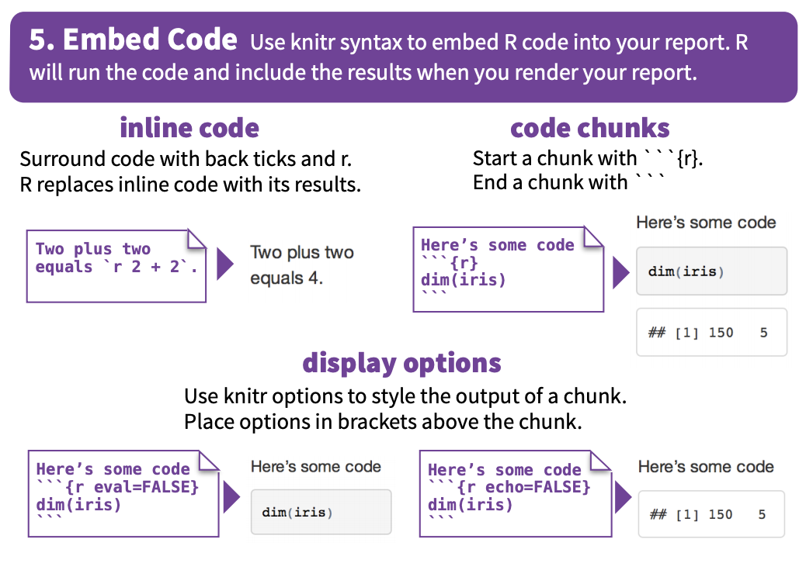
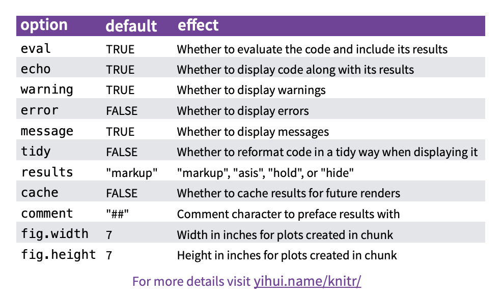
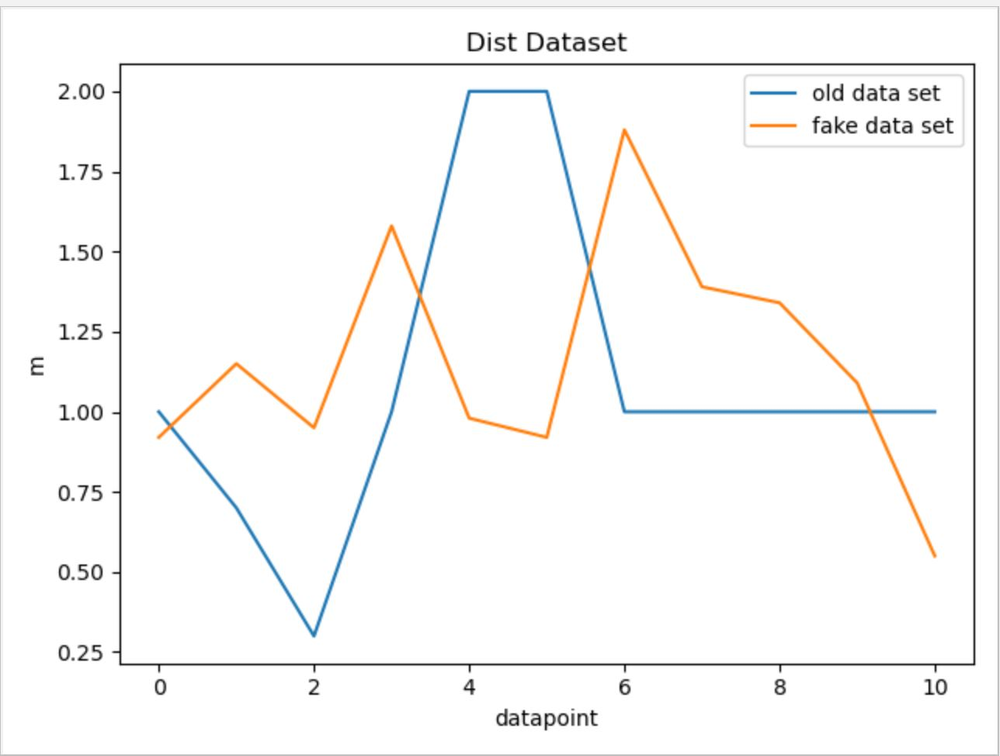
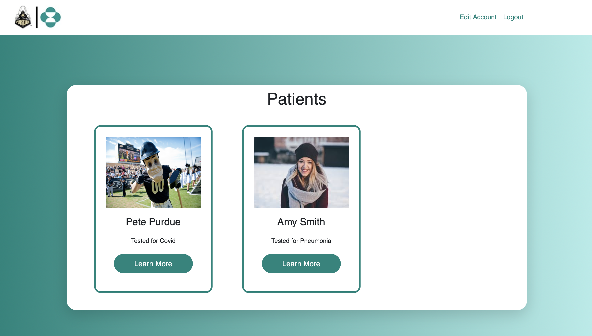
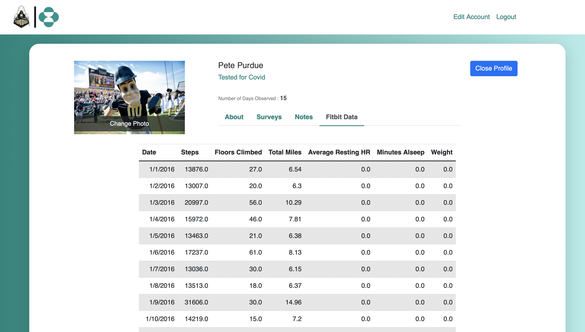
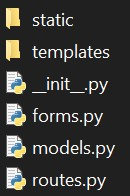

--- 
title: "Merck-Data Mine Documentation"
author: "Merck and Data Mine Corporate Partnership Team"
date: "`r Sys.Date()`"
site: bookdown::bookdown_site
output: bookdown::gitbook
documentclass: book
biblio-style: apalike
link-citations: yes
description: "A book for documenting the Merck-Data Mine team's work."
---

# Introduction {#introduction}

This book will serve as tutorial based documentation for the Merck - Data Mine Coporate Partnership team for the 2020-2021 academic year.

## Team Contacts

Mentors:

Terri Bui - yen.bui@merck.com
Kai Bode - kai.bode@merck.com

TA: 

Nick Rosenorn -	nrosenor@purdue.edu

Data Engineers:

Joshua Kosnoff - jkosnoff@purdue.edu
Allison	Hill - hill363@purdue.edu
Karthik	Ravishankar - kravish@purdue.edu
Pranav Anandarao - panandar@purdue.edu
Eric Yap - eyap@purdue.edu
Jennifer Leising - reagin@purdue.edu

Data Architects:

Connor Koelsch - ckoelsch@purdue.edu
Judy Si	- si12@purdue.edu
Denae Galloway - gallowd@purdue.edu
Praveen	Sentha - psentha@purdue.edu
Riya Mogli - rmogli@Purdue.edu

Data Visualization Developers:

Surya	Suresh - suresh49@purdue.edu
Priyanka	Seth - seth4@purdue.edu
Sharon Patta - spatta@purdue.edu
Ahmed Ashraf Butt - butt5@purdue.edu

Front End Engineers:

Alex Leung - leung49@purdue.edu
Dania	Khan - khan286@purdue.edu
Patricia Madalena Magalhaes Casaca - pmagalha@purdue.edu

Full Stack Engineers:

Siddharth	Srinivasan - sriniv75@purdue.edu
Xin	Du - du201@purdue.edu
Connor Koelsch - ckoelsch@purdue.edu
Abhimanyu	Agarwal - agarw184@purdue.edu
Anav Sharma	- sharm468@purdue.edu

<!--chapter:end:index.Rmd-->

# Tips for Writing Great Documentation and Walkthroughs

## Find a Good Topic

While writing documentation for a project, it would nearly impossible to include every piece work completed or every line of code written. This makes it important to pick important topics to write about. The goal is to include as much specificty as possible while also remembering the project as its entirety. 

Here are a few helpful concepts to consider when choosing a topic:

1. Step by step guides -- perfect for readers to learn quickly and implement in their own projects

2. In depth discussions of a specific topic  -- great for readers who are looking for deeper knowledge in a topic

3. Numbered lists of useful facts about a common topic -- lightweight readings that readers can consume in bits and pieces. 

## Make Goals and Audience Clear

For these writings, our team will have a dual purpose of writing them.

1. Record the work we have completed

2. Create a centralized location for tutorial based learning

The audience to consider is future team members of the Merck-Data Mine Corporate Partnership and Merck scientists looking to read and learn from our work.

Remember to keep the audience and goal of our documentation in mind as writing your entries.This will help the book keep continuiuty and give readers the best chance to get exposed to the work that we have completed.

## Have a Begining, Middle, and End

It is important to have an introduction, body, and conclusion while writing the documentation. This helps with fluidity within each document and allows for easier comprehension.

### Introduction

The introduction should encourage the reader to continue reading. Start with information about what will be covered in the read and how it applies to the project. Try to keep the introduction less technical so readers aren't discouraged by the complexity of the document.

### Body

The body is where you elaborate on all that you discussed in the introduction. Provide depth and instruction while still relating to the project as a whole. Use headings, photos, numbered lists, bullet points, and formatting to help provide small bits of information at a time. This is where you can facilitate a technical discussion with code.

### Conclusion

Always finish the read with a conclusion, providing assurance of what was just learned and include possible resources for more information (i.e. academic papers, blog posts, youtube videos). It is also appropriate to give the reader a domain in which to use the skills they have learned from your documentation.

## Getting Feedback and Iterate

Everyone on the team is encouraged to follow the documents that are added to this book. Read through them and provide helpful feedback to your teammate on how to improve. 

Some common things to look out for:

1. Formatting -- Does the document flow properly? Are there enough images, code, headers, etc...?

2. Formality -- Is the document written well? Is the language approiate?

3. Goal and Audience -- Does the document relate to the goals and target audiences of this book?

4. Attention -- Was the reading interesting? Is there opportunity to learn from the read?

## Practice, Practice, Practice

Writing the entries in this book will undoubtably get better over time. You are welcome to write as many entries as you'd like. They can be simple or deep, long or short, imformational or technical, etc. As long as the information in this book is informative and relevant to the projects we hope to complete, it is encouraged for all members of the team to write what they want!

<!--chapter:end:01-tips.Rmd-->

# Documentation Example - The Basics of R Markdown
```{r, echo=FALSE}
knitr::opts_chunk$set(echo = TRUE)
```

## Overview of R Markdown

R Markdown is a file format for making dynamic documents with R. An R Markdown document is written in markdown (an easy-to-write plain text format) and contains chunks of embedded R code, text, images, headers, and more. 

In this walkthrough, we'll discuss some of the functionality of R Markdown Documents and how to add images, code, and other features to the document. 

Throughout this tutorial, we'll be reviewing the contents of the R Markdown cheat sheet that has most important information for writing in Markdown. The cheat sheet can be found at https://rstudio.com/wp-content/uploads/2015/02/rmarkdown-cheatsheet.pdf.

## Workflow

One of the great features of Markdown files is that they can be rendered to PDF files, Word documents, HTML content, and more. This allows the writer to easily write in R and export the document how they see best.

Take a look at a common lifecylce of R Markdown documents in th following picture:


## Opening a New File

Writing R Markdown files is easiest within R Studio. Navigate to File > New File > R Markdown to create a new file.


## Helpful Syntax

Take a look through helpful sytax in this photo:


Here are some examples to vie. Take a look at the raw R Markdown to view the syntax in pratice.

*italics* 
**bold**
~~strikethrough~~

> Block Quote

* Bullets
* Bullets
  + subitem
  
1. Lists
2. Lists
  + subitem

## Embed Code

One of the best features of R Markdown is the ability to add code to your document. To add a code snippet, click on the green *insert* button in your R Studio tool bar and choose which language you would like to use!

```{r}
print("This is an R code snippet")
```

```{python, eval=FALSE}
print("This is a python code snippet with eval=FALSE")
```

```{bash}
echo this a bash code snippet
```




There are also many options for your code snippets. Take a look:



## Wrapping (or knitting) it Up

To knit your Markdown file you click the blue *knit* button in your R Studio toolbar. You can choose which file format you would like to knit to as well! 

For the purposes of our Merck-Data Mine documentation book, however, we will not have to knit anything because we are placing the individual documents in one bookdown book. To learn more about bookdown take a look at https://bookdown.org/yihui/bookdown/introduction.html for more information.

<!--chapter:end:02-template.Rmd-->

# Documentation Template

## Introduction

This section will give an overview of what was accomplished during the previous sprint.

## Code

This section is where important code can be documented and commented on. Some teams do not need to include all their code here as this would get excessive. However, important functions or classes should be documented and discussed here.

## Flow Diagrams / Visualizations

This is where teams should showcase flow diagrams of functions, data pipeline, etc. This might also be a good place for visualization/screenshots.

## White Paper

When important decision are made, such as software specifications or product developments, they should be documented in this section. Teams should explain how they came to the conclusion and key takeaways about the decision. 

## Technical Report

This section is where teams can highlight the processes of their work. This is a more in depth look into what was accomplised during the sprint where teams should describe step by step development. 

<!--chapter:end:03-template.Rmd-->

# Data Engineering Documentation

## Introduction to the Team

Our data engineering team is comprised of 6 team members all with unique skills and backgrounds. The team worked hard to utilize each member's strengths to help accomplish the semester goals for this project. 

Include a brief sentence including your name, major, year, and relevant experience to the data mine.

Jennifer Leising: I am a 3rd year graduate student in Industrial Engineering. My research is focused on healthcare and data analytics, and I have experience working in Clinical trials for a large Pharma company. 
Eric Yap: I am sophomore majoring in data science and finance. Most of my classes have helped developed my Python and R skills, which are very transferable to the work I do in the data mine.
Allison Hill: I am a senior majoring in electrical engineering. I have coding experience in various languages, including some Python and R which were used within this project.
Joshua Kosnoff: I am a junior majoring in  biomedical engineering. I perform research with the cancer research center, where I have previously learned Python for data management and basic analysis.
Karthik Ravishankar: I am a freshman majoring in data science. I have learned Java in highschool and at Purdue and some Python which was self taught to contribute to the project.
Pranav Anandarao: I am a sophomore majoring in computer engineering. I have experience in a few different programming languages, including Python. I also have previous experience working on clinical applications.

## Semester Goals

The overall aim of this project was to create a method to collect continuous data from patients in clinical trials. The biometrics team decided to do this by collecting data from Fitbit devices and developing an application to collect supplementary data from the users.

The data engineering team's task was to collect the data and put it into a usable format for storage with the data architecture team. This semester, our goal was to add functionality to collect data from multiple users and handle data coming in from different devices. Furthermore, we would like to be able to schedule the program to collect the user data periodically.


## Data Overview

### Fitbit Devices vs. Apple Watch

The 2019-2020 Merck Biometric team used the Fitbit to gather data for the project. The Merck stakeholder's had also mentioend wanting to explore the Apple Watch to reach additional populations. Our team wanted to better understand what data was available from each company’s devices. As a note, we listed all the features that would be available from any device. We created the chart below to list the features available on each device. We found very similar data to be available on both devices. 

                |                                       |Fitbit         |Apple Watch
 ---------------|---------------------------------------|---------------|---------------
 Activity       |Steps                                  |X              |X
                |Workouts                               |X              |X
                |Sit/Stand                              |X*             |NA
                |Flight Climbed                         |X              |X
                |Elevation                              |X              |X
                |Time spent in different activity levels|X              |X
                |Calories burned                        |X              |X
 Sleep          |Asleep vs Awake                        |X              |X
                |Stages                                 |X              |NA
 Heart Rate     |Time spent in different heart ranges   |X              |3rd party apps
                |Resting heart rate                     |X              |X
                |Walking Heartrate                      |NA             |X
                |Heart rate during activity             |X              |X
                |Intraday Tracking                      |5 sec          |10 min
 Nutrition      |Food log*                              |X              |X
                |Water log*                             |X              |X
 Body/Weight    |BMI*                                   |X              |X
                |Weight*                                |X              |X
 Additional     |ECG                                    |Coming soon    |X
                |Blood Oxygen                           |X              |X
                |Fall Detection                         |X              |X
                |Skin Thermometer                       |X              |NA
                |Ear Health                             |NA             |X
                |Stress Response                        |X              |NA
 ---------------------------------------------------------------------------------------
    *Entered manually
    NA = Not Available
 

With the Apple Watch, most data tracking is through the Health app and the files are exported as a .xml, which is difficult to read. However, you can also export your data through the Health app and have it opened in Numbers/Excel for easy viewing. For the FitBit, activity is recorded through the watch and outputs a .csv file when exporting, which is easy to read and open in applications like Excel and Numbers.

Additionally, it appears we are able to use Python in order to gather/sort data on both the Apple watch and Fitbit devices. Data is able to be read through pandas. Since Apple Watch returns a .xml file, we have to parse it first and use xmltodict module within Python before we can start applying functions to our data. 

Based on the scope for this semester, we did not do further research into the Apple Watch data collection, but this is one of our goal's for the coming Spring semester.

### Data Collected from Fitbit Devices

Our team collected data that can be grouped into several major categories:

    Device: Device Name

    Activites: totalDistance, veryActiveDistance, moderatleyActiveDistance, lightlyActiveDistance, veryActiveMinutes, fairlyActiveMinutes, 
    lightlyActiveMinutes, sedentaryMinutes, floorsClimbed, daySteps, intraday data
    
    Sleep: sleepEfficiency, minutesAsleep

    Heart Rate: HRrange30to100, HRrange100to140, HRrange140to170, HRrange170to220, avgRestingHR, intraday data

    Weight: weight, BMI


## Scaling the Framework

The framework for collecting biometric data from Fitbit's API was previously established and can be found in the [Merck Wearables Book section 8](https://nicholasrosenorn.github.io/wearables-book/tutorial-data-capture-in-python.html#authentication). However, this framework could only be used to collect one user's data at a time, and needed to be manually monitored to switch between browser and python windows. Further, the framework assumed that the user's Fitbit device would be the Fitbit Ionic. In order to make this project upscalable, the framework needed to be modified to support multiple users in an automizable way and to account for multiple device types. 

### Multiple Users

#### Supporting Multiple Users Via Accessing Credentials

To support multiple users, a database of multiple user login credentials needed to be created. There is an ongoing collaboration with the Front End team to create a more secure storage system, but for now credentials are stored in a csv file with the format "username,password". With the usernames and passwords stored in this way, a login array can be created that will be used to plug into the automated process.

```{python,eval=FALSE}
# Initialize Emails and Passwords lists
Emails = []
Passwords = []
# Create Emails and Passwords lists from Fitbit_Credentials.csv
with open("Fitbit_Credentials.csv") as File1:
    IDs = csv.DictReader(File1)
    for row in IDs:
        Emails.append(row['Username'])
        Passwords.append(row['Password'])
```

As previously mentioned, the previous framework was not set up for running through multiple accounts. To solve this issue, it was reformatted into iterative-friendly components. The first of which is the PythonBot.py file, which both establishes the login arrays outlined above and is responsible for coordinating the other file and function calls to make this process run smoothly. 

```{python,eval=FALSE}
# import other codes
import BiometricPrevious
import gather_keys_oauth2 as Oauth2
class FitbitBot:
    def __init__(self, EMAIL, PASSWORD, DATE):
        #Both the Client ID and Client Secret come from when Fitbit site after registering an app
        CLIENT_ID = '22BH28' 
        CLIENT_SECRET = '78a4838804c1ff0983591e69196b1c46'
        
        #Authorization Process
        server = Oauth2.OAuth2Server(CLIENT_ID, CLIENT_SECRET)
        server.browser_authorize(EMAIL, PASSWORD)
        ACCESS_TOKEN = str(server.fitbit.client.session.token['access_token'])
        REFRESH_TOKEN = str(server.fitbit.client.session.token['refresh_token'])
        auth2_client = fitbit.Fitbit(CLIENT_ID, CLIENT_SECRET, Oauth2=True, access_token=ACCESS_TOKEN,
        refresh_token=REFRESH_TOKEN)
        BiometricPrev = BiometricPrevious.FitbitModel1(auth2_client)
        
        biometricDF = BiometricPrev.getBiometricData(DATE) #append to data frame
        biometricDF.to_csv('./user' + str(i) + '_' + DATE + '.csv')
        print("Python Script Executed")
# Run data extraction
for i in range(len(Emails)):
    for j in range(1): # Call the previous 1 days worth of info <-- will be replaced with cronjob
        today = str((datetime.datetime.now() - datetime.timedelta(j)).strftime("%Y-%m-%d"))
        FitbitBot(Emails[i], Passwords[i], today)
```

The *BiometricPrevious* file contains the remainder of the previous framework with data collection functions, but it was also altered to allow for multiple devices. More information about his can be found in the **Multiple Devices** section of this report. 
The line *biometric.to_csv* will store the collected data in a csv format with a title of *user#_DATE*, where *user#* corresponds to the order at which the user's login credentials are stored in the credentials csv database.  

#### Supporting Multiple Users Via Allowing for Automation

In order to create an automation bot to regularly call the data collection code (see **Scheduling Our Data Collection** for more information on this), the code had to be adjusted so that it did not open browser windows, as the opening of browser windows was found to stall the bot. In order to accomplish this, the Selenium module was used. Official Selenium documentation can be found [here](https://selenium-python.readthedocs.io).

Since Selenium was not already downloaded on the device, it needed to be installed. To do this, the following was typed into a Terminal window:

```{python,eval=FALSE}
pip install selenium
```

To use Selenium in a code, the libraries and packages will need to be imported. Since *gather_keys_oauth2.py* is the only code package responsible for accessing websites, Selenium only needs to be imported into that document. To do this, the following code was added to *gather_keys_oauth2.py*.

```{python,eval=FALSE}
from selenium import webdriver
from selenium.webdriver import Firefox
from selenium.webdriver.firefox.options import Options
from selenium.webdriver.common.by import By
```

Strictly speaking, the only explicitly needed code would be *import Selenium*. However, by importing specific functions from the Selenium library upfront, notation later on was simplified. This can be seen below when firefox options were set. Instead of calling *Selenium.webdriver.firefox.options* every line, *Options* was able to be called instead. 

The appropriate Selenium firefox browser driver was downloaded [here](https://github.com/mozilla/geckodriver/releases). 

**Note** it does not matter where the driver is installed, but its installation path needs to be plugged into the gather_keys_oath2.py code. For those following along with the guide, make a note of the installation path.

The following block of code was written to set the Selenium webdriver functions.

```{python,eval=FALSE}
firefox_options = Options()
firefox_options.add_argument("window-size=1920,1080")
firefox_options.add_argument("--headless")
firefox_options.add_argument("start-maximized")
firefox_options.add_argument("--disable-infobars")
firefox_options.add_argument("--disable-extensions")
firefox_options.add_argument("--no-sandbox")
firefox_options.add_argument("--disable-dev-shm-usage")
firefox_options.binary_location = '/class/datamine/apps/firefox/firefox'
```

Adjust the path in the final option, *firefox_options.binary_location*, accordingly. 
The other main option of interest is *firefox_options.add_argument("--headless")*. This *headerless* option is what allows the code to access the Fitbit website without actually opening a browser -- effectively, Python becomes a browser simulator. This is the main reason Selenium was used. The other options are for optimal performance, but not strictly necessary.


The first time an account is added, manual permissions will need to be granted to Fitbit's authorization website. To do this, comment out this headerless option (place a “#” before the line), run the *PythonBot.py* code, and check the permissions boxes for each new account as it pops up. After doing this once, uncomment this headerless line. The system will then be ready for full automation.  

The official Selenium documentation also supports a Google Chrome driver. If Chrome is preferred, it can be substituted in for FireFox without issue. However, make sure to change all instances of *firefox* in the above codes to *Chrome.*

With Selenium downloaded and imported, the last step was to call and use Selenium. The following line in *browser_authorize* function in *gather_keys_oauth2.py* was responsible for opening the web browser, so it was targeted for edits. 

```{python,eval=FALSE}
    threading.Timer(1, webbrowser.open, args=(url,)).start()
```

As its name might suggest, the *webbrowser.open* function causes a web browser to open. The other passed arguments *1* and *args=(url,)* are parameters that can be left unchanged. This line was replaced with the following code: 

```{python,eval=FALSE}
    driver = webdriver.Firefox(executable_path = '/class/datamine/apps/geckodriver', options=firefox_options)
    driver.get("https://accounts.fitbit.com/login?targetUrl=https%3A%2F%2Fwww.fitbit.com%2Fus%2Fhome")
    sleep(5)
    driver.find_element(By.XPATH, "//input[@type='email']").send_keys(email)
    sleep(2)
    driver.find_element(By.XPATH, "//input[@type='password']").send_keys(password)
    sleep(2)
    driver.find_element(By.XPATH, "/html/body/div[2]/div/div[2]/div/div/div[3]/form/div[4]/div/button").click()
    sleep(10)
    
    threading.Timer(1, driver.get, args=(url,)).start()
```

The first line of the following code initializes the Selenium webdriver. Edit the *executable_path* as needed based on where the firefox driver was installed. The next line, *driver.get*, tells the Selenium web browser what website to go to. The *find_elements* commands are what allow for the automatization of plugging in usernames and emails. The sleep functions are input time delays to help make sure that the website has time to properly load before attempting to log in. The final line should look familiar. It is the same as the original line, except replacing the *webbrowser.open*, which opens a normal web browser, with *driver.get*, which calls Selenium's browser simulator. The rest of *gather_keys_oauth2* can remain as is.

#### Moving to Scholar

When multiple user logins were pushed and data extractions were performed in relatively quick succession on personal Wi-Fi, Fitbit's cybersecurity software flagged and temporarily banned the IP address from accessing their site. While these bans can be overturned by contacting Fitbit's customer support page on Twitter, the "unbanning" is temporary. This leads to a cycle of getting banned and asking to be unbanned, which is both inconvenient and detrimental to any long term data collection plans. The hope with Scholar is that, as an educational IP address, it can be whitelisted and the automated process can function without getting users banned. 

##### Using Scholar
To access Scholar, go to *https://scholar-fe03.rcac.purdue.edu:300/main/* and login with Purdue 2 Factor Credentials. 

The codes used for this part of the project are written in Python. Unfortunately, Scholar does not currently support Python IDEs (Spyder, VS code, etc). This means that the code either needs to be called through a Jupyter Notebook Kernel or through a terminal window. For now, the code will be run via Terminal commands.

To open Terminal, click on **Terminal Emulator** in Scholar's applications bar. Once Terminal is open, navigate to the */class* directory and then to the appropriate folder. To do this, type the following commands into Terminal:

```{python, eval=FALSE}
cd ..
cd ..
cd /class/datamine/corporate/merck/DataEngineers/Fitbit
```

Needed files and libraries have been installed on Scholar. Pathways within the code have been adjusted to Scholar's directory. As a result, there is only one more step that needs to be done before the code can be run. This step is to direct the python3 program where to find installed libraries. Type the following command into the Terminal:

```{python, eval=FALSE}
source /class/datamine/apps/python.sh
```
**Note** You will need to rerun this command everytime you close out of Terminal and reopen it.

Now, Scholar is ready to run PythonBot.py! To run the code, type the following into Terminal:

```{python, eval=FALSE}
python3 PythonBot.py
```

**Note** if the previous Terminal window was closed, navigate to */class/datamine/corporate/merck/DataEngineers/Fitbit* again before running *python3 PythonBot.py*

Extracted data is formatted into CSV files and accessible at */class/datamine/corporate/merck/DataEngineers/Fitbit/CSV_Files*.

### Multiple Devices
Not all fitbit devices have the same data available to them. This is most noticeable in older models, in which functionality such as the number of floors climbed or sleep cycles was not yet implemented. Using the get_Devices function available in the Fitbit API, the code returns a string corresponding to the Fitbit version. For example, a Fitbit Ionic would return the string "Ionic". Using this information, if-else statements were implemented to check the version and assign corresponding data values. Data that is not available would be input as "None" within the data table. In some cases, the function can simply check if the data is NULL and automatically do this such as with the sleep data. However for data such as activity levels, the data gets input as a "0" instead and thus needs a check. Checks for some of the newer models have been implemented, along with a generic case. The table below shows the implemented models and their available data:
                |                                       |Ionic         | Versa Lite  |Inspire      |Charge 3     |
 ---------------|---------------------------------------|--------------|-------------|-------------|-------------|
 Activity       |Steps                                  |X             |X            |X            |X            |
                |Workouts                               |X             |X            |             |             |
                |Sit/Stand                              |X             |X            |             |             |
                |Flight Climbed                         |X             |             |             |             |
                |Elevation                              |X             |             |             |             |
                |Time spent in different activity levels|X             |X            |             |             |
                |Calories burned                        |X             |X            |             |             |
 Sleep          |Asleep vs Awake                        |X             |X            |X            |X            |
                |Stages                                 |X             |X            |             |             |
 Heart Rate     |Time spent in different heart ranges   |X             |X            |             |X            |
                |Resting heart rate                     |X             |X            |             |X            |
                |Walking Heartrate                      |X             |X            |             |X            |
                |Heart rate during activity             |X             |X            |             |X            |
 -----------------------------------------------------------------------------------------------------------------
 
The following function is what is used to obtain the device model string:

```{python, eval=FALSE}
def getDevice():
    devices = auth2_client.get_devices()
    if(len(devices) == 0):
        deviceVersion = 'None'
    else:
        deviceVersion = devices[0]['deviceVersion']    
    return deviceVersion
```

The function first calls the built-in Fitbit API get_devices(). Next it checks the length of the output to determine if it is valid. If it is not valid, the user must not have any device registered. At the moment, the code only obtains the first device if a user has multiple registered.

## Scheduling the Data Collection

Through using the CronTab module within Python, we are able to schedule and run our FitBit functions on a routinely basis. The data we collect is stored in a dataframe and new data is continuously appended to this dataframe. The scheduled time is set to every 9 AM on weekdays.


## Collaborating with other Teams

Our team had three main interactions with the other teams. The first one was with the Data Architects. When reviewing last year's code, we noticed that sending a CSV file everytime would be inneficient. We discovered a function, dataFrame.to_sql(), which would allow the data to be sent straight into the SQL server. Although a solution was found, we decided to leave the code how it is and save this idea for another day. The second and third interactions were with the Front End team. The first time, we wanted to see if there was a way to easily collect the user's fitbit username and password. The Front End team was able to create a way to have the login information collected from mobile app and saved on the SQL server with the help of the Back End team. This was a very important problem to solve as the API needs to log into the user's fitbit account to pull their data. Our last collaboration was regarding a issue that would result in complications during the clinical trial. Regardless of whether the user is wearing their device or not, any time the fitbit wasn't in an active motion, time is accrued on the user's sedentary minutes. This would be a problem as there is no way to differentiate whether the user was sedentary, or if the fitbit wasn't on the user. After conversing with the Front End team, we decided that an alert system or question during their survey would help solve this issue. This problem is a work in progress and doesn't have a solution as of yet. 

## Future Work

Our future work for the Spring 2021 semester seeks to build upon our work completed during this Fall 2020 semester. Our main goals are listed include: (1) streamlining our work with the other Merck biometric teams to ensure the entire process works well from start to finish, (2) exploring alternative ways to access the user's fitbit information that might better align with the way fitbit intends multiple user data collection, and (3) investigating the collection of data from the Apple Watch.

(1) Streamlining work with the other Merck Biometric teams
(2) Exploring alternative ways to access the user's fitbit information 
(3) Investigating the collection of data from the Apple Watch

## Data Engineering Spring 2021 Documentation

## Completing the Pipeline

In order to connect data collection process to the rest of the pipeline, it had to be able to read patient information and login credentials from the SQL database, as well as automatically append the collected biometric data to a database. In order to accomplish this, the PythonBot.py code had to be able to connect to SQL. This was done by first importing the necessary sqlachemy pacakges and then establishing a connection to our specific database.

To import packages:
```{python,eval=FALSE}
# using sqlalchemy
import sqlalchemy as sal
from sqlalchemy import create_engine
import pandas as pd
```

To establish connection to SQL database: 
```{python,eval=FALSE}
# establish connecttion URL
conn = "mysql+pymysql://{0}:{1}@{2}:{3}/{4}".format(
    'cb3i17t0aqn6a4ff', 'e2l4k9zn24shcj42', 'rnr56s6e2uk326pj.cbetxkdyhwsb.us-east-1.rds.amazonaws.com', '3306', 'lfry112yqr3k2dfr')
 
# create engine
engine = sal.create_engine(conn)
```

If another SQL database is used in the future, please note that 'cb3i17t0aqn6a4ff' corresponds to 'username', 'e2l4k9zn24shcj42' corresponds to 'password', 'rnr56s6e2uk326pj.cbetxkdyhwsb.us-east-1.rds.amazonaws.com' corresponds to 'address', '3306' corresponds to 'port', and 'lfry112yqr3k2dfr' corresponds to 'DB'. Change these values as appropriate in the code.

### Reading in user data from patient table

Patient data was imported as a series of arrays. The SQL patient table was read in as df1, which was used to form lists of data corresponding to individual patient's emails, passwords, IDs, and usernames.

```{python, eval=FALSE}
df1 = pd.read_sql_query("SELECT * FROM patient", engine)
emails = []
passwords = []
IDs = []
usernames = []
for i in range(len(df1)):
    emails.append(df1.email[i])
    passwords.append(df1.fitbit_password[i])
    IDs.append(df1.patient_id[i])
    usernames.append(df1.username[i])
```

As was previously the case, this data was iterated through and plugged into the FitbitBot function.

### Appending user data to SQL table

Once data was collected (collection functions can be found in *BiometricPrevious_getDevice_v2.py*), it needed to be appended to the SQL database. A new function was made to reformat the data to have the same column names as the SQL table. 

```{python, eval=FALSE}
def appendDataBase(DATA,ENGINE, USER, ID):
    obj = pd.DataFrame()
   
    obj['patient_id'] = [ID]
    obj['fbusername'] = [USER]
    obj['collection_date'] = [DATA.get("Date")]
    obj['steps'] = [DATA.get("Steps")]
    obj['floors_climbed'] = [DATA.get("Floors Climbed")]
    obj['total_miles'] = [DATA.get("Total Miles")]
    obj['lightly_active_miles'] = [DATA.get("Lightly Active Miles")]
    obj['moderately_active_miles'] = [DATA.get("Moderately Active Miles")]
    obj['very_active_miles'] = [DATA.get("Very Active Miles")]
    obj['sedentary_minutes'] = [DATA.get("Sedentary Minutes")]
    obj['lightly_active_minutes'] = [DATA.get("Lightly Active Minutes")]
    obj['fairly_active_minutes'] = [DATA.get("Fairly Active Minutes")]
    obj['very_active_minutes'] = [DATA.get("Very Active Minutes")]
    obj['hr30_100_minutes'] = [DATA.get("HR 30-100 Minutes")]
    obj['hr100_140_minutes'] = [DATA.get("HR 100-140 Minutes")]
    obj['hr140_170_minutes'] = [DATA.get("HR 140-170 Minutes")]
    obj['hr170_220_minutes'] = [DATA.get("HR 170-220 Minutes")]
    obj['average_resting_hr'] = [DATA.get("Average Resting HR")]
    obj['bmi'] = DATA.get("BMI")
    obj['sleep_efficiency'] = DATA.get("Sleep Efficiency")
    obj['weight'] = DATA.get("Weight")
    obj["minutes_asleep"] = todaysData.get("Minutes Alseep")
 
    obj.to_sql("fitbit_data", con=ENGINE, if_exists='append', index= False)
   
    return(None)
```

In this function, the argument *DATA* is a dataframe returned from *biometric_previous_getDevice_v2.py*, *ENGINE* is the connection engine to the SQL database, and *USER* and *ID* correspond to the user's Fitbit username and Merck trial userID. The *to_sql* function at the end is responsible for exporting the reformatted data to the *"fitbit_data"* table in the SQL database. The *if_exists='append'* argument is responsible for appending to the database instead of overwriting it, and the *index=False* argument stops the code from creating the original indexing as a column in SQL. 

More documentation on .to_sql can be found here: https://pandas.pydata.org/docs/reference/api/pandas.DataFrame.to_sql.html

In order to pass the userID and fitbit username to the SQL database, the FitbitBot function and function call had to be slightly altered. 

```{python, eval=FALSE}
class FitbitBot:
    def __init__(self, EMAIL, PASSWORD, DATE, usernames, ID):
 
        #Both the Client ID and Client Secret come from when Fitbit site after registering an app
        CLIENT_ID = '22BH28' #Mine:'22BKP3'
        CLIENT_SECRET = '78a4838804c1ff0983591e69196b1c46' #Mine:'1a42e97b6b4cc640572ae5cf10a7d0b0'
        #Authorization Process
        # opens website
        server = Oauth2.OAuth2Server(CLIENT_ID, CLIENT_SECRET)
        # opens website
        server.browser_authorize(EMAIL, PASSWORD)
        ACCESS_TOKEN = str(server.fitbit.client.session.token['access_token'])
        REFRESH_TOKEN = str(server.fitbit.client.session.token['refresh_token'])
        auth2_client = fitbit.Fitbit(CLIENT_ID, CLIENT_SECRET, Oauth2=True, access_token=ACCESS_TOKEN,
        refresh_token=REFRESH_TOKEN)
        BiometricPrev = BiometricPrevious.FitbitModel1(auth2_client)
        bioDict, biometricDF = BiometricPrev.getBiometricData(DATE) #append to data frame
        title = './CSV_Files/user' + str(i) + '_' + DATE + '.csv'
        appendDataBase(bioDict,engine,usernames,ID)
        print("Python Script Executed")
```
usernames and ID arguments were added to the function. The appendDataBase function call was also added into the function, and BiometricPrev.getBiometricData(DATA) was slightly altered to return both a dictionary and a database.

Since the function arguments were exanded, the function call also had to be adjusted to pass usernames[i] and IDs[i]. 

```{python, eval=FALSE}
today = str((datetime.datetime.now() - datetime.timedelta(1)).strftime("%Y-%m-%d"))
# Run data extraction
for i in range(len(emails)):
    FitbitBot(emails[i], passwords[i], today, usernames[i], IDs[i])
```

## Automating the Process

## Automating the Pipeline

Automating the process was done two different ways. One was done through Cronjob and is useful for UNIX (Mac, linux) operating systems. This was used while the code was on Scholar. However, Scholar had period cronjob wipes, which meant that the automated process had to continually be re-established (and that defeated the purpose!). As a result, the code stopped being run on Scholar and was moved onto the Merck E2C AWS server. This was Windows based, so Task Scheduler was used.  

### Cronjob (for Mac and Linux)

Open Terminal. To see a list of current cronjob, type the following:

```{python, eval=FALSE}
crontab -l
```

To edit a crontab or edit an existing one:

```{python, eval=FALSE}
crontab -e
```

Type *i* to enter INSERT mode. Enter your cronjob command. For the case of this project on scholar, the following was used:

```{python, eval=FALSE}
0 1 * * * cd /class/datamine/corporate/merck/DataEngineers/Fitbit && /class/datamine/apps/python/f2020-s2021/env/bin/python3.8 PythonBot.py
``` 

The first 5 characters are timing instructions. The first one (0) corresponds to the minute. The second (1) corresponds to the hour. The 3rd corresponds to the day of the month, then month, then day of the week. An asterisk indicates that the job will run for every value in those corresponding categories. As a result

```{python, eval=FALSE}
0 1 * * * 
``` 
 will run everyday at 1am. 

*cd* navigates to a file directory. **Note** that if your python functions are in PATH, you can navigate to your file directly before issuing the crontab -e command, in which case you can simply type: 

```{python, eval=FALSE}
0 1 * * * PythonBot.py
``` 

However, since python is not currently in PATH on scholar, the path to both the desired code (PythonBot.py) and had to be indicated in the command.

Type *:wq* to write the command and quit Insert mode. Type crontab -l in Terminal to confirm set up.

### Task Scheduler (Windows)

Windows provides a GUI for their scheduling program. To open it, click on the microscope search icon in the bottom of the screen (or right click on the windows icon and select ‘search’) and type *Task Scheduler*. Open the application.

In the *Actions* sidebar, click on *Create Task*. Name the program and navigate to the *Triggers* tab. The trigger tab is tells Windows how often to run the program. Add a new trigger by clicking on *New*. Specify how often to run the program. The current project was made to run everyday at 1 am, and this was accomplished by selecting *Daily*, adjusting the start time to 1am, and clicking *ok*. 

**Note** The E2C instance is not based in EST time. Make sure that your entered time is actually your desired time.

Now its time to tell the Task Scheduler what program to actually run. Click on the *Actions* tab and add a new action. Browse for the script to automate. Click *ok*. The *Conditions* and *Settings* tabs offer more customization, but are not needed for the purposes of this project. Click *ok* to save the task.

The added ask should show up in the main page of the GUI. Confirm that it does and that its status is *Enabled*. If its status is *Disabled*, right click on the task and select *Enable*.

The program is now ready to run automatically!

## Exploring Apple HealthKit and XCode

Our team decided to start looking into creating the data aquisition script for the Apple Watch. This led us to Apple HealthKit. HealthKit allows access to and the ability to share health and fitness data that is collected using an iPhone and/or Apple Watch. We explored the the documentation that Apple had to offer and began learning how to use HealthKit. To use HealthKit to access the user's health data, we had to begin learning the language Swift and the IDE, XCode The problem we quickly encountered was that this could only be fully explored on Apple devices. In addition to exploring HealthKit and XCode on our own, we also searched for resources that we could use to assist in developing the data aquisition script. A lot of what we found was able to read and write the data but not export the data. Our current plan is to utilize a code template that walks through the authentication and data collection process and then directly send the data to the AWS database.

A few other options exist for collecting the data from the Apple Watch. React Native can be used to develop an IOS application to collect and store the data fron the watch. However, apple devices are still needed to build and deploy the application, and thus not providing much advantage over a Swift based application. Another method to collect the data could be to utilize Google Fit and the pre-existing Google API. This would require the user to download the Google Fit application on their phone and signing in, which creates an intermediary that wouldn't be necessary in the other implementations. In the end, these two other implementations were not used in favor of the Swift implementation.

## Thank you & Acknowledgements

We would like to thank our Merck Corporate Partners, TA, and all the Data Mine staff that have helped us throughout this semester. 

<!--chapter:end:04-Data_Engineers_Final_Focumentation.rmd-->

# Data Architects 

## What is a database?

A database is an organized collection of data stored electronically. It is typically controlled by a database management system (DBMS). There are two main categories a database can fall into: relational and non-relational. A relational database is one that stores data in rows and columns, otherwise known as a table. While a simple database may include only one table, a typical functional database contains multiple tables. These tables are linked to each other using keys. A primary key is a unique identifier and is referenced by other tables. When in another table, it is considered a foreign key. While it is not necessary, it is common practice to include a primary key in every table. Nearly all relational databases rely on the programming language SQL (Structured Query Language) to query, manipulate, and define data, as well as provide access control. 

The term “non-relational database” is a blanket term for all other databases that do not rely on SQL, hence their other name, NoSQL. These databases can take on many forms: key-value store, document store, column-oriented databases, and graph databases, to name a few.

## How to create the database: 

First step would be to download mySQL on a machine.
https://www.mysql.com/ is the website where the software can be downloaded. 
Click on “Downloads” on the top of the tabs, and scroll down to click on MySQL Community (GPL) Downloads. Next click on “MySQL Community Downloads”. Please select the correct operating system based on your machine type. Also, make sure to check system versions and download archives based on the critias. After downloading this go back and click on MySQL Workbench downloads. Make sure to follow the previous instructions and download the workbench similar to how communities were downloaded. 

Once everything is downloaded please go into mySQL.  Make sure to set a good password for your connection. Once in MySQL click on Local instance. The script for the database including the comments it written below. In order to transfer the database into your own system please paste the script into your mySQL. After pasting everything in click on the lighting shape button with a one symbol to run your code. 


## Basic SQL key:

-- (Whenever there is a comment amongst the code this is typed before the comment. Similar to # in python) 

VARCHAR(): this is character data. The number in the parenthesis is the amount of characters in the word saved in the tables.

FLOAT: this stores an approximate value and decimal. An example would be that monet data would use FLOAT.

INT: This is a data type that is a primary integer data type. 


## MySQL Script: 

-- This is the code that loads different settings into your database.
-- MySQL Workbench Forward Engineering
 
/*!40101 SET @OLD_CHARACTER_SET_CLIENT=@@CHARACTER_SET_CLIENT */;
/*!40101 SET @OLD_CHARACTER_SET_RESULTS=@@CHARACTER_SET_RESULTS */;
/*!40101 SET @OLD_COLLATION_CONNECTION=@@COLLATION_CONNECTION */;
/*!40101 SET NAMES utf8 */;
/*!40103 SET @OLD_TIME_ZONE=@@TIME_ZONE */;
/*!40103 SET TIME_ZONE='+00:00' */;
/*!40014 SET @OLD_UNIQUE_CHECKS=@@UNIQUE_CHECKS, UNIQUE_CHECKS=0 */;
/*!40014 SET @OLD_FOREIGN_KEY_CHECKS=@@FOREIGN_KEY_CHECKS, FOREIGN_KEY_CHECKS=0 */;
/*!40101 SET @OLD_SQL_MODE=@@SQL_MODE, SQL_MODE='NO_AUTO_VALUE_ON_ZERO' */;
/*!40111 SET @OLD_SQL_NOTES=@@SQL_NOTES, SQL_NOTES=0 */;
 
-- This is the first table for the Merck database. CREATE TABLE IF NOT EXISTS notifies mySQL to create a new table. After this would be the name for the table. 
-- -----------------------------------------------------
-- Schema Merck database
-- -----------------------------------------------------
CREATE SCHEMA IF NOT EXISTS `Merck database` DEFAULT CHARACTER SET utf8 ;
USE `Merck database` ;
 -- -----------------------------------------------------
-- Table `Merck database`.`User`: This table will store information for the website. When the user first creates an account. 
-- -----------------------------------------------------
CREATE TABLE IF NOT EXISTS `Merck database`.`User` (
  `id` INT NOT NULL,
  `username` VARCHAR(20) NOT NULL,
  `First_Name` VARCHAR(100) NOT NULL,
  `Last_Name` VARCHAR(100) NOT NULL,
  `date_of_birth` INT NOT NULL,
  `Height` INT NOT NULL,
  PRIMARY KEY (`id`),
  UNIQUE INDEX `username_UNIQUE` (`username` ASC))
ENGINE = InnoDB;
 -- -----------------------------------------------------
-- Table `Merck database`.`MerckData`: This is the table that will store the written data in the website. 
-- ------------------------------------------------------
CREATE TABLE IF NOT EXISTS `Merck database`.`MerckData` (
  `ID` INT NOT NULL,
  `input_date` INT NOT NULL,
  `family_history_cancer` VARCHAR(500) NULL,
  `Family_history_heart_disease` VARCHAR(500) NULL,
  `diagnostic_notes` VARCHAR(500) NULL,
  PRIMARY KEY (`ID`))
ENGINE = InnoDB;
 -- -----------------------------------------------------
-- Table `Merck database`.`Pain_Data`: This is the data that the patient inputs themselves. 
-- -----------------------------------------------------
CREATE TABLE IF NOT EXISTS `Merck database`.`Pain_Data` (
  `Username` VARCHAR(20) NOT NULL,
  `input_date` DATETIME NOT NULL,
  `happiness` FLOAT NULL,
  `Sleep` FLOAT NULL,
  `hours_worked` FLOAT NULL,
  `Symptoms` VARCHAR(100) NULL,
  `Meals` FLOAT NULL,
  `medication_timing` VARCHAR(200) NULL,
  `smoking_alcohol` VARCHAR(200) NULL,
  `Other_medication` VARCHAR(200) NULL,
  `water_intake` FLOAT NULL,
  `diagnosis` VARCHAR(300) NULL,
  PRIMARY KEY (`Username`))
ENGINE = InnoDB;
 -- -----------------------------------------------------
-- Table `Merck database`.`User_MerckData`: This is the script that will connect the Merck database and User_MerckData. 
-- -----------------------------------------------------
CREATE TABLE IF NOT EXISTS `Merck database`.`User_MerckData` (
  `User_id` INT NOT NULL,
  `MerckData_ID` INT NOT NULL,
  PRIMARY KEY (`User_id`, `MerckData_ID`),
  INDEX `fk_User_has_MerckData_MerckData1_idx` (`MerckData_ID` ASC),
  INDEX `fk_User_has_MerckData_User_idx` (`User_id` ASC),
  CONSTRAINT `fk_User_has_MerckData_User`
	FOREIGN KEY (`User_id`)
	REFERENCES `Merck database`.`User` (`id`)
	ON DELETE NO ACTION
	ON UPDATE NO ACTION,
  CONSTRAINT `fk_User_has_MerckData_MerckData1`
	FOREIGN KEY (`MerckData_ID`)
	REFERENCES `Merck database`.`MerckData` (`ID`)
	ON DELETE NO ACTION
	ON UPDATE NO ACTION)
ENGINE = InnoDB;
-- -----------------------------------------------------
-- Table `Merck database`.`User_Pain_Data`: This is the script that will connect the Merck database and User_pain_data. 
-- -----------------------------------------------------
CREATE TABLE IF NOT EXISTS `Merck database`.`User_Pain_Data` (
  `User_id` INT NOT NULL,
  `Pain_Data_Username` VARCHAR(20) NOT NULL,
  PRIMARY KEY (`User_id`, `Pain_Data_Username`),
  INDEX `fk_User_has_Pain_Data_Pain_Data1_idx` (`Pain_Data_Username` ASC),
  INDEX `fk_User_has_Pain_Data_User1_idx` (`User_id` ASC),
  CONSTRAINT `fk_User_has_Pain_Data_User1`
	FOREIGN KEY (`User_id`)
	REFERENCES `Merck database`.`User` (`id`)
	ON DELETE NO ACTION
	ON UPDATE NO ACTION,
  CONSTRAINT `fk_User_has_Pain_Data_Pain_Data1`
	FOREIGN KEY (`Pain_Data_Username`)
	REFERENCES `Merck database`.`Pain_Data` (`Username`)
	ON DELETE NO ACTION
	ON UPDATE NO ACTION)
ENGINE = InnoDB;
 -- -----------------------------------------------------
-- Table `Merck database`.`FitBit_Data`: This is the table that will store data from the Fitbit. 
-- -----------------------------------------------------
CREATE TABLE IF NOT EXISTS `Merck database`.`FitBit_Data` (
  `Username` INT NOT NULL,
  `Collection_Date` INT NOT NULL,
  `Steps` VARCHAR(45) NULL,
  `Floors_climbed` FLOAT NULL,
  `total_miles` FLOAT NULL,
  `Lightly_Active_miles` FLOAT NULL,
  `moderately_active_miles` FLOAT NULL,
  `Very_active_miles` FLOAT NULL,
  `Lightly_active_minutes` FLOAT NULL,
  `fairly_active_minutes` FLOAT NULL,
  `very_active_minutes` FLOAT NULL,
  `hr30-100_minutes` FLOAT NULL,
  `hr100-140_minutes` FLOAT NULL,
  `hr140-170_ minutes` FLOAT NULL,
  `hr170_220_minutes` FLOAT NULL,
  `average_resting_hr` FLOAT NULL,
  `bmi` FLOAT NULL,
  `minutes_asleep` FLOAT NULL,
  `sleep_efficiency` FLOAT NULL,
  `Weight` FLOAT NULL,
  `Stress_score` INT NULL,
  `Blood_oxygen_saturation` INT NULL,
  PRIMARY KEY (`Username`))
ENGINE = InnoDB;
 -- -----------------------------------------------------
-- Table `Merck database`.`Apple_Data`: This is the table that will store the Apple Watch data. 
-- -----------------------------------------------------
CREATE TABLE IF NOT EXISTS `Merck database`.`Apple_Data` (
  `Username` VARCHAR(20) NOT NULL,
  `Collection_Date` INT NULL,
  `Steps` INT NULL,
  `activeEnergyBurned` FLOAT NULL,
  `activeEnergyBurnedGoal` FLOAT NULL,
  `activeEnergyBurnedUnit` FLOAT NULL,
  `appleExerciseTime` FLOAT NULL,
  `appleExerciseTimeGoal` FLOAT NULL,
  `appleStandHours` FLOAT NULL,
  `appleStandHoursGoal` FLOAT NULL,
  `sourceName` FLOAT NULL,
  `sourceVersion` FLOAT NULL,
  `device` FLOAT NULL,
  `type` FLOAT NULL,
  `unit` FLOAT NULL,
  `creationDate` FLOAT NULL,
  `startDate` FLOAT NULL,
  `endDate` FLOAT NULL,
  `value` FLOAT NULL,
  `workoutActivityType` FLOAT NULL,
  `duration` FLOAT NULL,
  `durationUnit` VARCHAR(45) NULL,
  `totalDistance` VARCHAR(45) NULL,
  `totalDistanceUnit` VARCHAR(45) NULL,
  `totalEnergyBurned` VARCHAR(45) NULL,
  `totalEnergyBurnedUnit` VARCHAR(45) NULL,
  PRIMARY KEY (`Username`))
ENGINE = InnoDB;
-- -----------------------------------------------------
-- Table `Merck database`.`Garmin_Data`: This table will store the data from the Garmin Watch. 
-- -----------------------------------------------------
CREATE TABLE IF NOT EXISTS `Merck database`.`Garmin_Data` (
  `Username` VARCHAR(20) NOT NULL,
  `Collection_Date` INT NULL,
  `Steps` INT NULL,
  `floors_climbed` FLOAT NULL,
  `total_miles` FLOAT NULL,
  `lightly_active_miles` FLOAT NULL,
  `moderately_active_miles` FLOAT NULL,
  `Very_active_miles` FLOAT NULL,
  `Sedentary_minutes` FLOAT NULL,
  `lightly_active_minutes` FLOAT NULL,
  `fairly_active_minutes` FLOAT NULL,
  `very_active_minutes` FLOAT NULL,
  `hr30-100_minutes` FLOAT NULL,
  `hr100-140_minutes` FLOAT NULL,
  `hr140-170_minutes` FLOAT NULL,
  `hr170-220_minutes` FLOAT NULL,
  `average_resting_hr` FLOAT NULL,
  `bmi` VARCHAR(45) NULL,
  PRIMARY KEY (`Username`))
ENGINE = InnoDB;
-- -----------------------------------------------------
-- Table `Merck database`.`User_Apple_Data`
-- -----------------------------------------------------
CREATE TABLE IF NOT EXISTS `Merck database`.`User_Apple_Data` (
  `User_id` INT NOT NULL,
  `Apple_Data_Username` VARCHAR(20) NOT NULL,
  PRIMARY KEY (`User_id`, `Apple_Data_Username`),
  INDEX `fk_User_has_Apple_Data_Apple_Data1_idx` (`Apple_Data_Username` ASC),
  INDEX `fk_User_has_Apple_Data_User1_idx` (`User_id` ASC),
  CONSTRAINT `fk_User_has_Apple_Data_User1`
	FOREIGN KEY (`User_id`)
	REFERENCES `Merck database`.`User` (`id`)
	ON DELETE NO ACTION
	ON UPDATE NO ACTION,
  CONSTRAINT `fk_User_has_Apple_Data_Apple_Data1`
	FOREIGN KEY (`Apple_Data_Username`)
	REFERENCES `Merck database`.`Apple_Data` (`Username`)
	ON DELETE NO ACTION
	ON UPDATE NO ACTION)
ENGINE = InnoDB;
 -- -----------------------------------------------------
-- Table `Merck database`.`User_Garmin_Data`
-- -----------------------------------------------------
CREATE TABLE IF NOT EXISTS `Merck database`.`User_Garmin_Data` (
  `User_id` INT NOT NULL,
  `Garmin_Data_Username` INT NOT NULL,
  PRIMARY KEY (`User_id`, `Garmin_Data_Username`),
  INDEX `fk_User_has_Garmin_Data_Garmin_Data1_idx` (`Garmin_Data_Username` ASC),
  INDEX `fk_User_has_Garmin_Data_User1_idx` (`User_id` ASC),
  CONSTRAINT `fk_User_has_Garmin_Data_User1`
	FOREIGN KEY (`User_id`)
	REFERENCES `Merck database`.`User` (`id`)
	ON DELETE NO ACTION
	ON UPDATE NO ACTION,
  CONSTRAINT `fk_User_has_Garmin_Data_Garmin_Data1`
	FOREIGN KEY (`Garmin_Data_Username`)
	REFERENCES `Merck database`.`Garmin_Data` (`Username`)
	ON DELETE NO ACTION
	ON UPDATE NO ACTION)
ENGINE = InnoDB;
 -- -----------------------------------------------------
-- Table `Merck database`.`User_Fitbit_Data`
-- -----------------------------------------------------
CREATE TABLE IF NOT EXISTS `Merck database`.`User_Fitbit_Data` (
  `User_id` INT NOT NULL,
  `Fitbit_Data_Username` VARCHAR(20) NOT NULL,
  PRIMARY KEY (`User_id`, `Fitbit_Data_Username`),
  INDEX `fk_User_has_Fitbit_Data_Fitbit_Data1_idx` (`Fitbit_Data_Username` ASC),
  INDEX `fk_User_has_Fitbit_Data_User1_idx` (`User_id` ASC),
  CONSTRAINT `fk_User_has_Fitbit_Data_User1`
	FOREIGN KEY (`User_id`)
	REFERENCES `Merck database`.`User` (`id`)
	ON DELETE NO ACTION
	ON UPDATE NO ACTION,
  CONSTRAINT `fk_User_has_Fitbit_Data_Fitbit_Data1`
	FOREIGN KEY (`Fitbit_Data_Username`)
	REFERENCES `Merck database`.`Fitbit_Data` (`Username`)
	ON DELETE NO ACTION
	ON UPDATE NO ACTION)
ENGINE = InnoDB;
 
 -- This is the code that will package the whole script. 
 
/*!40101 SET CHARACTER_SET_CLIENT=@OLD_CHARACTER_SET_CLIENT */;
/*!40101 SET CHARACTER_SET_RESULTS=@OLD_CHARACTER_SET_RESULTS */;
/*!40101 SET COLLATION_CONNECTION=@OLD_COLLATION_CONNECTION */;
 

## How to connect the SQL database to AWS:
 
Make sure to replace the host name with the correct one that connects to the AWS account. Next enter your username, and lastly enter in the password that associates with the account. If the error of admin access comes up. It would be best to send the AWS account owner the SQL script and they can directly connect it from their machine. This error has come up before and this was one of the fastest ways to solve this problem.

## How to load dummy data into mySQL:

A key part of loading dummy data into mySQL is looking at the table columns. The first step in the process is finding dummy data and formatting this into a CSV file. After this it’s important to make sure the dummy data columns align with the column values in the database. For example we had to change a couple of columns in the database such as floors climbed to keep the data collected by the database accurate. The lines we used to load the dummy data into the apple watch table and fitbit data below:

load data local infile "fitbit.csv" into table Fitbit_Data
FIELDS TERMINATED BY ',' 
	 lines terminated by '\n'
     ignore 1 rows
     (Username	, Collection_Date, Steps, floors_climbed, total_miles, lightly_active_miles,
     moderately_active_miles, very_active_miles, sedentary_minutes,
     lightly_active_minutes, fairly_active_minutes,
     very_active_mintes,  
     hr30_100_minutes,
     hr100_140_minutes, hr140_170_minutes, hr170_220_minutes, average_resting_hr, bmi, minutes_asleep, sleep_efficiency, Weight)


load data local infile “ActivitySummary.csv" into table Apple_Data
FIELDS TERMINATED BY ',' 
	 lines terminated by '\n'
     ignore 1 rows
     (dataComponents, 
activeEnergyBurned, activeEnergyBurnedGoal, 
activeEnergyBurnedUnit,
appleExerciseTime,
appleExerciseTimeGoal,
appleStandHours,
appleStandHoursGoal,)


load data local infile “DistanceWalkingRunning.csv" into table Apple_Data
FIELDS TERMINATED BY ',' 
	 lines terminated by '\n'
     ignore 1 rows
     (sourceName, 
sourceVersion, device, 
Type,
unit,
creationDate
startDate,
endDate,
value)

load data local infile 
“StepCount.csv" into table Apple_Data
FIELDS TERMINATED BY ',' 
	 lines terminated by '\n'
     ignore 1 rows
     (sourceName, 
sourceVersion, device, 
Type,
unit,
creationDate
startDate,
endDate,
value)

load data local infile 
“Workout.csv" into table Apple_Data
FIELDS TERMINATED BY ',' 
	 lines terminated by '\n'
     ignore 1 rows
     (sourceName, 
sourceVersion, device, 
Type,
unit,
creationDate
startDate,
endDate,
workoutActivityType,
Duration,
durationUnit, 
totalDistance,
totalDistanceUnit,
totalEnergyBurned,
totalEnergyBurnedUnit)


## Database Creation with Neo4j
Neo4j is a graph database created by Neo4j inc. Neo4j is implemented in Java; however, it
can also be written with any other cypher query language.

1. create(u:user {name:'User'})-[:makes]->(n:user{name:'Username'})
return u,n

Instead of creating a new nodefor User we can just match the node with the new node you want to create. The create section describes the relationships between the two nodes. The ‘User’ and ‘Username’ section is the code for the new node. The return section is the
code for return which would store the nodes into the system.

2.
match (u:User{name : 'User'}) Create (u)-[: Enters] -> (DA : User{name : 'Date Of Birth'})
Return u,DA

The match statement creates relationships between 2 nodes. This line of code codes for a new node “Last Name” which stores the last name of the patient. This node holds a relationship with the User node. 

3. match(u:user {name:'User'}) create (u)- [:enters]-> (LN:user{name:'Last Name'}) return u,LN 

Similar to the code on the third line. A new node has been created, however this node is created to store the last name of the user. 

4. match(u:user {name:'User'}) create (u)- [:enters]-> (FN:user{name:'First Name'}) return u,FN 

A new node is created with this code. The node stores the Height of the user. 

5. match(u:user {name:'User'}) create (u)- [:enters]-> (H:user{name:'Height'}) return u,H 
The ID node is created, thus allowing for the user id to be stored. 

6. match(u:user {name:'User'}) create (u)- [:enters]-> (I:user{name:'ID'}) return u,I 

This line of code codes for a new node “Merck Data” which stores the last name of the patient. This node holds a relationship with the ID node. 

7. match(I:user{name:'ID'}) create (I)- [:enters]-> (M:user{name:'Merck Data'}) return I,M 

This line of code codes for a new node “Family History Cancers” which stores the family history cancers of the patient. This node holds a relationship with the Merck Data node. 

8. match(M:user{name:'Merck Data'}) create (M)- [:enters]-> (FH:user{name:'Family History Cancers'}) return M,FH 

Lines 9, 10, and 11 all code for three new nodes “Diagnostic notes”, “ Any other family history disease”, and “Input Data”. This node holds a relationship with the Merck Data node. 

9. match(M:user{name:'Merck Data'}) create (M)- [:enters]-> (ID:user{name:'Input Data'}) return M,ID 
10. match(M:user{name:'Merck Data'}) create (M)- [:enters]-> (DN:user{name:'Diagnostic Notes'}) return M,DN 
11. match(M:user{name:'Merck Data'}) create (M)- [:enters]-> (AD:user{name:'Any other family history in disease'}) return M,AD 

This line of code helps put together all of the nodes. This is to help you check your database while you add new nodes. This line of code will be used throughout to double check the code, and to endure every branch is in the correct spot. 


12. MATCH (n:user) RETURN n LIMIT 100 

This code creates the relationship between the node “Username” and the new node “fitbit data”. The new node will store fitbit data. 

13. match(n:user{name:'Username'}) create (n)- [:enters]-> (FD:user{name:'FitBit Data'}) return n, FD 
14. match(FD:user{name:'FitBit Data'}) create (FD)- [:enters]-> (WE:user{name:'Weight'}) return FD,WE 
15. match(FD:user{name:'FitBit Data'}) create (FD)- [:enters]-> (CD:user{name:'Collection Date'}) return FD,CD 
16. match(FD:user{name:'FitBit Data'}) create (FD)- [:enters]-> (B:user{name:'BMI'}) return FD,B 
17. match(FD:user{name:'FitBit Data'}) create (FD)- [:enters]-> (FC:user{name:'Floors Climbed'}) return FD,FC 
18. match(FD:user{name:'FitBit Data'}) create (FD)- [:enters]-> (ARH:user{name:'Average Resting Hr'}) return FD,ARH 
19. match(FD:user{name:'FitBit Data'}) create (FD)- [:enters]-> (ST:user{name:'Steps'}) return FD,ST 

This line of code codes for a new node “Miles” which stores the miles of the patient. This node holds a relationship with the Fitbit Data Node 

20. match(FD:user{name:'FitBit Data'}) create (FD)- [:enters]-> (Mi:user{name:'Miles'}) return FD,Mi 
Lines 20,21,22,23,24,25 all code for new nodes that hold relationships with the Fitbit node. 
21. match(FD:user{name:'FitBit Data'}) create (FD)- [:enters]-> (TM:user{name:'Total Miles'}) return FD,TM 
22. match(FD:user{name:'FitBit Data'}) create (FD)- [:enters]-> (VAM:user{name:'Very Active Miles'}) return FD,VAM 
23. match(FD:user{name:'FitBit Data'}) create (FD)- [:enters]-> (LAM:user{name:'Lightly Active Miles'}) return FD,LAM 
24. match(FD:user{name:'FitBit Data'}) create (FD)- [:enters]-> (MAM:user{name:'Moderately Active Miles'}) return FD,MAM 
25. match(FD:user{name:'FitBit Data'}) create (FD)- [:enters]-> (S:user{name:'Sleep'}) return FD,S 

Lines 26,27 all codes for new nodes that holds relationships with the “Sleep node”. 

26. match(S:user{name:'Sleep'}) create (S)- [:enters]-> (SE:user{name:'Sleep Efficiency'}) return S,SE 
27. match(S:user{name:'Sleep'}) create (S)- [:enters]-> (MAS:user{name:'Minutes Asleep'}) return S,MAS 
Lines 28,29,30,31,32,33,34,35,36 all codes for new nodes that hold relationships with the “minute node”. 
28. match(FD:user{name:'FitBit Data'}) create (FD)- [:enters]-> (M:user{name:'Minutes'}) return FD,M 
29. match(M:user{name:'Minutes'}) create (M)- [:enters]-> (OF:user{name:'hr 140-170'}) return M,OF 
30. match(M:user{name:'Minutes'}) create (M)- [:enters]-> (SM:user{name:'Sedentary Minutes'}) return M,SM 
31. match(M:user{name:'Minutes'}) create (M)- [:enters]-> (LAM:user{name:'Lightly Active Minutes'}) return M,LAM 
32. match(M:user{name:'Minutes'}) create (M)- [:enters]-> (FAM:user{name:'Fairly Active Minutes'}) return M,FAM 
33. match(M:user{name:'Minutes'}) create (M)- [:enters]-> (VAM:user{name:'Very Active Minutes'}) return M,VAM 
34. match(M:user{name:'Minutes'}) create (M)- [:enters]-> (HR:user{name:'hr 30-100'}) return M,HR 
35. match(M:user{name:'Minutes'}) create (M)- [:enters]-> (HR1:user{name:'hr 100-140'}) return M,HR1 
36. match(M:user{name:'Minutes'}) create (M)- [:enters]-> (HR2:user{name:'hr 170-220'}) return M,HR2 

Lines 37-49 all codes for new nodes that hold relationships with the “Pain Data” node. The portions after ‘name’ are the new nodes. 

37. MATCH (n:user) RETURN n LIMIT 100 
38. match(u:user {name:'User'}) create (u)- [:enters]-> (PD:user{name:'Pain Data'}) return u,PD 
39. match(PD:user{name:'Pain Data'}) create (PD)- [:enters]-> (D:user{name:'Diagnosis'}) return PD,D 
40. match(PD:user{name:'Pain Data'}) create (PD)- [:enters]-> (WI:user{name:'Water Intake'}) return PD,WI 
41. match(PD:user{name:'Pain Data'}) create (PD)- [:enters]-> (MT:user{name:'Medication Timing'}) return PD,MT 
42. match(PD:user{name:'Pain Data'}) create (PD)- [:enters]-> (DA:user{name:'Date'}) return PD,DA 
43. match(PD:user{name:'Pain Data'}) create (PD)- [:enters]-> (HA:user{name:'Happiness'}) return PD,HA 
44. match(PD:user{name:'Pain Data'}) create (PD)- [:enters]-> (OM:user{name:'Other Medication'}) return PD,OM 
45. match(PD:user{name:'Pain Data'}) create (PD)- [:enters]-> (SL:user{name:'Sleep'}) return PD,SL 
46. match(PD:user{name:'Pain Data'}) create (PD)- [:enters]-> (HW:user{name:'Hours Worked'}) return PD,HW 
47. match(PD:user{name:'Pain Data'}) create (PD)- [:enters]-> (US:user{name:'Unusual Symptoms'}) return PD,US 
48. match(PD:user{name:'Pain Data'}) create (PD)- [:enters]-> (M:user{name:'meals'}) return PD,M 
49. match(PD:user{name:'Pain Data'}) create (PD)- [:enters]-> (SA:user{name:'Smoking/Alcohol'}) return PD,SA 

## Inputting Dummy Data into Fitbit Neo4j Database
After creating the Database, this semester we were able to input dummy data into the Fitbit database. After uploading Dr. Ward’s fitbit data into Neo4j, I was able to put the data into the database by changing the names of the nodes to fit the name of the columns on Dr. Wards fitbit data csv. I was able to run tests and find results using Dr. Wards sample data and the fitbit neo4j database. 

## Challenges with Creating Neo4j Database
While creating the Neo4j database, we ran into issues while trying to properly represent things that were shared between multiple nodes (patient ID for example).  To make it known that this was being collected or entered in each node, we had to make sure it was included as a branch for each main node.  We also had to make sure that each datapoint had the correct representation of whether it was being collected or entered by the patient.

<!--chapter:end:05-Data_Architecture_Final_Documentation.Rmd-->

# Data visualization Team 

## Biometric Wearables 

This project is a part of the Purdue data science initiative, where students are given an opportunity to work on the data-driven project, guided by an industry mentor. This Biometric Wearables project is a part of an ongoing collaboration between the Purdue and Merck industry. Following is the brief description of the project:

## Purpose

The purpose of the project is to create an automated system that will capture the biometric data from wearable fitness technology using the mobile application and communicate its’ result to Merck scientists. 

## Outcome

This automated system will be able to collect accurate and less biased data from the clinical trial patients because the digital process reduces the human error and reduce the pressure on the clinical trial patient with manual processing procedure. 

## Significance

This project may help to reduce the experiment biased by collecting more extensive data and using the technology. Also, this approach may help to reduce the clinical trial time and cost to ease of data collection.

## Overview of Data visualization Team 

This team is a part of a big team working on the above-described project, part of the Merck-Purdue data science collaboration. This team has been assigned the responsibility to design rich, interactive graphics, data visualization, and plotting method to facilitate the MERCK scientists. In addition, this team is responsible for brainstorming the data, and experiments with different visualization techniques that can help the project.

## Previous Work Done on the project

The previous team that worked on the data visualization aspect of this project created a baseline shiny website that had some specific widgets created. There are two pages on the shiny website i.e., activity progress and step goals. The activity progress has a bar chart that shows the progress by comparing two biometric data points. The bar chart has an x-axis which is to show the dates and a y-axis which is to show the steps. One of the widget’s features on this page was created to view a specific time period of the data. The second page is to show step goals using a pie chart. 

## Team Members 

Following is the brief introduction of the data visualization team members:
(Ahmed Ashraf Butt and Sharon Patta participated in the first semester)

### Ahmed Ashraf Butt 

He is a doctoral student at the School of Engineering Education, Purdue University. He is currently working as a research assistant on the CourseMIRROR project funded by the Institute of Education Sciences (IES). He is interested in designing educational tools and exploring their impact on enhancing students’ learning experiences. Also, he is working on the Merck-Purdue data science collaboration responsible for creating an automated system that will capture the biometric data from the wearable fitness technology using the mobile application and communicate its result to Merck scientists. 

### Pika Seth

She is a second-year student in the College of Engineering studying Biomedical Engineering at Purdue University. She is currently involved with the Data Mine Corporate Program working on the Biometrics Wearable Project with Merck. She is involved with the data visualization aspect dealing with the programming of R Shiny. She is a part of the Red Cross Club and the Women in Engineering Program. Also, she is a part of the Sigma Delta Tau sorority. 

### Sharon Patta

She is a first-year student in the College of Science at Purdue University. She is studying data science. Her interests are in the fields of AI and machine learning.

### Surya Suresh

He is a first-year student in the College of Science at Purdue University studying Computer Science. He is working with the Merck Data Mine group on the Data Visualization part of the project. He is responsible for creating new visualisations to add to the R Shiny Dashboard.

## Team formation

The team has worked together to become more familiar with R programming and shiny application. Each member of the group explored different data visualizations and then, worked colloborately to implement a new visualization or improving the previous shiny app. Additionally, the group had several meetings to collectively present findings to one another and discuss errors and troubleshooting. 


## Term 1 goals

We are going to begin working on adding more features to the old Shiny App as well as implementing our own visualizations that we think would be useful. We also need to figure out where we are getting our data from once the API is running because as of right now we are just taking it off of the CSV file that has Dr. Ward’s data.

## Visulization 1

In this visualization, we were able to create a visualization that adapts to the given data and creates a Data Table with all of the given data. We used the Data Tables library to
accomplish this. The Data Table contains two main tabs. One tab contains all of the mean values of the given data. The other tab allows the user to  navigate through all of the data points in a clean and efficient way.Specifically it allows the user to filter the data as well as list the data in  any desired order. For example, the data can be listed in order from the days 
with the most steps to the days with the least. 

### Semester 1 Code

```{r setup, include=FALSE}
knitr::opts_chunk$set(echo = TRUE)
```

I imported the libraries needed for the visualization
```{r, eval = FALSE}
library(shiny) #Used for Shiny Dashboard
library(ggplot2) #Needed for Plots (Not specifically this Viz)
library(reshape2) #Needed for Plots (Not specifically this Viz)
library(DT) #Used for the Data Tables used in this Vizualization
```

biometric data
'bioFinal.csv' for biometric data from 2020 Feb. to present? - Merckteam's data
'DrWardData.csv' for biometric data from 2016 to 2019 April - Dr. Ward's data

Used to read data into the myDF data frame
```{r, eval = FALSE}
myDF <- read.csv("liveMerck.csv",TRUE,",")
```
active miles (stacked)

```{r, eval = FALSE}
miles1 <- subset(myDF, select = c('Date','Lightly.Active.Miles',
                                  'Moderately.Active.Miles',
                                  'Very.Active.Miles'))
miles <- melt(miles1)
miles$Date <- as.Date(miles$Date)
```

active minutes (stacked)

```{r, eval = FALSE}
minutes1 <- subset(myDF, select = c('Date', 'Sedentary.Minutes',
                                    'Lightly.Active.Minutes',
                                    'Fairly.Active.Minutes',
                                    'Very.Active.Minutes'))
minutes <- melt(minutes1)
minutes$Date <- as.Date(minutes$Date)
```

HR minutes (stacked)
```{r, eval = FALSE}
hr1 <- subset(myDF, select = c('Date', 'HR.30.100.Minutes',
                               'HR.100.140.Minutes', 'HR.140.170.Minutes',
                               'HR.170.220.Minutes'))
hr <- melt(hr1)
hr$Date <- as.Date(hr$Date)
```

Finding out the collums index with numeric value in it. 
```{r, eval = FALSE}
columsIndexWithNumberValue <- unlist(lapply(myDF, is.numeric)) 
```

Extracting the columns with number value in it.
```{r, eval = FALSE}
columWithNumber <- myDF[ , columsIndexWithNumberValue]
```

finding the mean of all collum's mean
```{r, eval = FALSE}
meansOFColumWithNumber <- lapply(columWithNumber[,], mean,na.rm=TRUE)
```

Converting them back into data frame. 
```{r, eval = FALSE}
meansOFColumWithNumberDataFrame<-data.frame(matrix(unlist(meansOFColumWithNumber), nrow=length(meansOFColumWithNumber), byrow=T))
```

Extracting the name of the collums names from columWithNumber.
```{r, eval = FALSE}
colName<- data.frame(names(columWithNumber))
```

Extracting the name of the collums.
```{r, eval = FALSE}
finalDataFrame <- data.frame(a=colName, c=meansOFColumWithNumberDataFrame)
```

changing the Collum name of the final dataframe
```{r, eval = FALSE}
colnames(finalDataFrame)[1]<-"Variables"
colnames(finalDataFrame)[2]<-"Mean Values"
```

myDF to date format
```{r, eval = FALSE}
myDF$Date = as.Date(myDF$Date)
```

Remove the X column from myDF
```{r, eval = FALSE}
drops <- c("X")
myDF <- myDF[ , !(names(myDF) %in% drops)]
```


UI of the Application
```{r, eval = FALSE}
# Uses the fluidPage and a Sidebar Layout
ui <- fluidPage(
  title = "Tester",
  titlePanel("Visualization 1"),
  sidebarLayout(
    sidebarPanel(
      # This panel contains the first Data Table
      conditionalPanel(
        #input.dataset is used in DT's to show which data is actually used
        'input.dataset === "myDF"',
        #Included a checkbox for what columns should be in the data Table
        #The pre selected columns are "Date" and "Steps"
        checkboxGroupInput("show_vars", "Columns of information to show:",
                           names(myDF), selected = list("Date", "Steps"))
      ),
      # This panel contains the second Data Table
      conditionalPanel(
        #input.dataset is used in DT's to show which data is actually used
        'input.dataset === "finalDataFrame"',
        #We can change this text to anything we want user to see
        helpText("Click the column header to sort a column.")
      ),
    ),
    mainPanel(
      # Allows the user to pick between the 2 tabs containing the Data Tables
      tabsetPanel(
        #name of the tabs
        id = 'dataset',
        #First tab named "myDF" contains Data Table from first set of data
        tabPanel("myDF", DT::dataTableOutput("mytable1")),
        #Second tab named "finalDataFrame" contains DT from second set of data
        tabPanel("finalDataFrame", DT::dataTableOutput("mytable2"))
      )
    )
  )
)
```

Server of the Application
```{r, eval = FALSE}
server <- function(input, output) {
  # choose columns to display
  myDF2 = myDF[sample(nrow(myDF), nrow(myDF), replace = FALSE), ]
  #Used to render the actual Data Table based off any changes made by the user
  #Changes based on what variables are selected and the filter feature is
  #located on the top of the Data Table
  output$mytable1 <- DT::renderDataTable({
    DT::datatable(myDF2[, input$show_vars, drop = FALSE], rownames = FALSE, filter = 'top')
  })
  
  #Used to render teh Data Table and does not have many features like the first
  #Data Table. This one only contains the means (finalDataFrame)
  output$mytable2 <- DT::renderDataTable({
    DT::datatable(finalDataFrame, options = list(orderClasses = TRUE), rownames = FALSE)
  })
}
```

Runs the application
```{r, eval = FALSE}
shinyApp(ui, server)
```
## Visulization 2

In this visulization, we categorizes the data into three categories: Steps and Floors Climbed, Distance, and Activity Level. Each category contains bar graphs that display the data for each respective variable per month. Both the Distance and the Activity Level categories display visualizations that separate the data into different subcategories based on the intensity of the activity.


### Code

```{r, eval=FALSE}
library(shiny)
library(ggplot2)
library(reshape2)
# biometric data
# 'bioFinal.csv' for biometric data from 2020 Feb. to present? - Merckteam's data
# 'DrWardData.csv' for biometric data from 2016 to 2019 April - Dr. Ward's data

#This function reads in the CSV file that contains the data, named DrWardData.csv, and stores it in a data frame called myDF. The argument for the read.csv function is the path where the CSV file is located.
myDF <- read.csv("/class/datamine/corporate/merck/Merck201920/fitbit_data/DrWardData.csv")

# The subset function selects the data from the myDF data frame that separates the miles the user has walked by activity level, as well as the date column. This subset is stored as "miles1".
# The melt function then takes the columns stored in miles1 and stacks them into a single column in "miles".
# The as.Date function goes into the Date column of "miles" and correctly formats the values as a date.
miles1 <- subset(myDF, select = c('Date','Lightly.Active.Miles', 'Moderately.Active.Miles', 'Very.Active.Miles'))
miles <- melt(miles1)
miles$Date <- as.Date(miles$Date)

# The subset function selects the data from the myDF data frame that separates the minutes the user spends in activity by activity level, as well as the date column. This subset is stored as "minutes1".
# The melt function then takes the columns stored in minutes1 and stacks them into a single column in "minutes".
# The as.Date function goes into the Date column of "minutes" and correctly formats the values as a date.
minutes1 <- subset(myDF, select = c('Date', 'Sedentary.Minutes', 'Lightly.Active.Minutes', 'Fairly.Active.Minutes', 'Very.Active.Minutes'))
minutes <- melt(minutes1)
minutes$Date <- as.Date(minutes$Date)

# The subset function selects the data from the myDF data frame that separates the data by the number of minutes the user spent with heart rate between 30-100 bpm, 100-140 bpm, 140-170 bpm, and 170-220 bpm, as well as the date column. This subset is stored as "hr1".
# The melt function then takes the columns stored in hr1 and stacks them into a single column in "hr".
# The as.Date function goes into the Date column of "hr" and correctly formats the values as a date.
hr1 <- subset(myDF, select = c('Date', 'HR.30.100.Minutes', 'HR.100.140.Minutes', 'HR.140.170.Minutes', 'HR.170.220.Minutes'))
hr <- melt(hr1)
hr$Date <- as.Date(hr$Date)

# The as.Date function goes into the Date column of "myDF" and correctly formats the values as a date.
# The first format function goes into the year column of "myDF" and formats the values as a year.
# The second format function goes into the month column of "myDF" and formats the values as unabbreviated month names.
myDF$Date = as.Date(myDF$Date)
myDF$year <- format(myDF$Date,'%Y')
myDF$month <- factor(format(myDF$Date,'%B'), levels = month.name)

# Every shiny app must include a UI header beginning with fluidPage()
# fluidPage() allows the user to adjust the size of their window while preserving the dimensions of the display
ui<-fluidPage(
  # The first section of code uses the navbarPage() function to create the menu at the top of the page titled “Fitbit Dashboard” that allows the user to select the “How to Use” page, the “Activity Progress” page, or the “Step Goals” page
  
  # Creates a menu of selections titled "Fitbit Dashboard"
  navbarPage("Fitbit Dashboard",          
             # tabPanel 1
             
             # The tabPanel() function creates the “How to Use” tab in the Fitbit Dashboard and includes the images, displays, and texts to be shown on the page
             tabPanel("How to Use",
                      # Includes Merck logo
                      img(src = "https://assets.phenompeople.com/CareerConnectResources/MERCUS/social/1200x630-1552902977090.jpg", height = 120, width = 220),
                      # Creates main title "Biometric Data Dashboard"
                      h1("Biometric Data Dashboard"),
                      mainPanel(
                        # Includes bolded text and link
                        strong("Refer to the website here for more information:"),
                        a("https://www.merck.com/index.html"),
                        # Smaller heading than h1 to create title "How to Use My Dashboard"
                        h3("How to Use My Dashboard"),
                        # Outputs HTML "text2" which is included in the server block
                        htmlOutput("text2")
                      )                      
             ), 
             
             # tabPanel 2
             
             # The tabPanel() function creates the “Activity Progress” tab in the Fitbit Dashboard and includes the images, displays, and texts to be shown on the page
             tabPanel("Activity Progress",
                      sidebarLayout(
                        # Creates title "Activity Progress" for sidebar panel
                        sidebarPanel(h3("Activity Progress"),
                                     # Allows user to input date range
                                     dateRangeInput("dates", ("Date range")),
                                     # Allows user to select single y-axis variable for graph
                                     varSelectInput("variables", ("Variable:"), myDF[c(-1, -2)]),
                                     # Allows user to select variable y-axis (includes all levels of selected on the same graph)
                                     selectInput("stack", ("Variable (Stacked):"),
                                                 c("N/A" = "nana", "Active Miles" = "miles", "Active minutes" = "minutes", "HR minutes" = "hr")),
                        ),
                        # Creates the main panel
                        mainPanel(
                          # Includes italicized text
                          em("Select a date range and a variable!"),
                          # Includes bolded text
                          strong("Refer to the website here for more information:"),
                          # Includes link
                          a("https://www.merck.com/index.html"),
                          # Displays the bar graph with selected variable
                          plotOutput(outputId = "bioBarGraph")
                        )
                      )
             ), 
             
             # tabPanel 3
             
             # The tabPanel() function creates the “Step Goals” tab in the Fitbit Dashboard and includes the images, displays, and texts to be shown on the page
             tabPanel("Step Goals",
                      # Creates sidebar panel with smaller heading "10,000-Step Goal"
                      sidebarPanel(h3("10,000-Step Goal"),
                                   # Allows user to input one specific date
                                   dateInput("goaldate", ("Date"))
                      ),
                      # Creates the main panel
                      mainPanel(
                        # Includes bolded text
                        strong("Refer to the website here for more information:"),
                        # Includes link
                        a("https://www.merck.com/index.html"),
                        # Displays pie chart
                        plotOutput(outputId = "bioDoughnut")
                      )
             ),
             # tabPanel 4
             
             # The tabPanel() function creates the “Visualization 2” tab in the Fitbit Dashboard and includes the images, displays, and texts to be shown on the page
             tabPanel("Visualization 2",
                      sidebarLayout(
                        # Creates title "Activity Progress" for sidebar panel
                        sidebarPanel(h3("Visualization 2"),
                        ),
                        # Creates the main panel
                        mainPanel(
                          # Includes bolded text
                          strong(HTML("Activity graphs are listed below <br/>")),
                          strong("Steps and Floors Climbed"),
                          # Displays the bar graph that shows total steps per month
                          plotOutput(outputId = "bioStep"),
                          # Displays the bar graph that shows total floors climbed per month
                          plotOutput(outputId = "bioFloors"),
                          # Includes bolded text
                          strong(HTML("Distance <br/>")),
                          # Includes italicized text
                          em("This section shows the total distance walked per month in miles, as well as a breakdown of the activity level of the distance walked."),
                          # Displays the bar graph that shows total miles walked per month
                          plotOutput(outputId = "bioTM"),
                          # Displays the bar graph that shows total number of lightly active miles walked per month
                          plotOutput(outputId = "bioLM"),
                          # Displays the bar graph that shows total number of moderately active miles walked per month
                          plotOutput(outputId = "bioMM"),
                          # Displays the bar graph that shows total number of very active miles walked per month
                          plotOutput(outputId = "bioVM"),
                          # Includes bolded text
                          strong(HTML("Activity Level <br/>")),
                          # Includes italicized text
                          em("This section shows the time spent in each level of activity."),
                          # Displays the bar graph that shows the amount of time spent being lightly active per month
                          plotOutput(outputId = "bioLA"),
                          # Displays the bar graph that shows the amount of time spent being fairly active per month
                          plotOutput(outputId = "bioFA"),
                          # Displays the bar graph that shows the amount of time spent being very active per month
                          plotOutput(outputId = "bioVA"),
                        )
                      )
             )
  )
)

              
server <- function(input, output) {
  
  # You can access the values of the widget (as a vector of Dates)
  # with input$dates, 
  # e.g. output$value <- renderPrint({ input$dates })
  
  # text on tabPanel 1 
  output$text2 <- renderUI({    
    HTML(paste("", "1. Activity Progress with Bar Charts",
               "- Date Range: select a start and an end date to set a date range of the activity progress",
               "- Variables: use the drop-down to select a variable of the activity progress you wish to see",
               "- Variables (Stacked): use the drop-down to select a variable of the activity progress you wish to see as a stacked bar chart",
               "", "2. Step Goals with Doughnut Charts", 
               "- Date: select a date of the activity progress you wish to see",
               sep="<br/>"))
  })
  
  # bar charts on tabPanel 2
  output$bioBarGraph <- renderPlot({
    
    # counter for the start date - date range
    counter1 = 0
    for (myDate in as.character(myDF$Date)){
      counter1 = counter1 + 1
      if (myDate == input$dates[1]) {
        break
      }
    }
    
    # counter for the end date - date range
    counter2 = 0
    for (myDate in as.character(myDF$Date)){
      counter2 = counter2 + 1
      if (myDate == input$dates[2]) {
        break
      }
    }
    
    # subset of myDF with the selected date range
    mySubset <- myDF[c(counter1:counter2),]    
    if (input$stack == "nana"){ # single bar chart - if stacked bar is N/A
      ggplot(data=mySubset, aes(x=Date, y=!!input$variables)) + geom_bar(stat="identity", width = .5, fill = "#13A999")
    }else if(input$stack == "miles"){ # stacked bar chart - active miles
      ggplot(data=miles, aes(x=Date, y=value, fill=variable)) + geom_bar(stat="identity", width = .5)
    }else if(input$stack == "minutes"){ # stacked bar chart - active minutes
      ggplot(data=minutes, aes(x=Date, y=value, fill=variable)) + geom_bar(stat="identity", width = .5)
    }else if(input$stack == "hr"){ # stacked bar chart - HR minutes
      ggplot(data=hr, aes(x=Date, y=value, fill=variable)) + geom_bar(stat="identity", width = .5)
    }
  })
  # Visualization 2
  # Bar graph that shows total steps per month
  output$bioStep <- renderPlot({
    ggplot(data = myDF, aes(x = month, y= Steps))+
      geom_bar(stat = "identity", color = "#007a73", width = 0.5, position = position_dodge(width = 0.6), fill = "#007a73") +
      ggtitle("Total Steps per Month") +
      xlab("Month") +
      ylab("Steps")
  })
  
  # Bar graph that shows total floors climbed per month
  output$bioFloors <- renderPlot({
    ggplot(data = myDF, aes(x = month, y= Floors.Climbed))+
      geom_bar(stat = "identity", color = "#007a73", width = 0.5, position = position_dodge(width = 0.6), fill = "#007a73") +
      ggtitle("Total Floors Climbed per Month") +
      xlab("Month") +
      ylab("Floors Climbed")
  })
  
  # Bar graph that shows total miles walked per month
  output$bioTM <- renderPlot({
    ggplot(data = myDF, aes(x = month, y= Total.Miles))+
      geom_bar(stat = "identity", color = "#007a73", width = 0.5, position = position_dodge(width = 0.6), fill = "#007a73") +
      ggtitle("Total Miles Walked per Month") +
      xlab("Month") +
      ylab("Miles")
  })
  
  # Bar graph that shows lightly active miles walked per month
  output$bioLM <- renderPlot({
    ggplot(data = myDF, aes(x = month, y= Lightly.Active.Miles))+
      geom_bar(stat = "identity", color = "#007a73", width = 0.5, position = position_dodge(width = 0.6), fill = "#007a73") +
      ggtitle("Lightly Active Miles Walked per Month") +
      xlab("Month") +
      ylab("Miles")
  })
  
  # Bar graph that shows moderately active miles walked per month
  output$bioMM <- renderPlot({
    ggplot(data = myDF, aes(x = month, y= Moderately.Active.Miles))+
      geom_bar(stat = "identity", color = "#007a73", width = 0.5, position = position_dodge(width = 0.6), fill = "#007a73") +
      ggtitle("Moderately Active Miles Walked per Month") +
      xlab("Month") +
      ylab("Miles")
  })
  
  # Bar graph that shows very active miles walked per month
  output$bioVM <- renderPlot({
    ggplot(data = myDF, aes(x = month, y= Very.Active.Miles))+
      geom_bar(stat = "identity", color = "#007a73", width = 0.5, position = position_dodge(width = 0.6), fill = "#007a73") +
      ggtitle("Very Active Miles Walked per Month") +
      xlab("Month") +
      ylab("Miles")
  })
  
  # Bar graph that shows the amount of time spent being lightly active per month
  output$bioLA <- renderPlot({
    ggplot(data = myDF, aes(x = month, y= Lightly.Active.Minutes))+
      geom_bar(stat = "identity", color = "#007a73", width = 0.5, position = position_dodge(width = 0.6), fill = "#007a73") +
      ggtitle("Time Spent Being Lightly Active per Month") +
      xlab("Month") +
      ylab("Minutes")
  })
  
  # Bar graph that shows the amount of time spent being fairly active per month
  output$bioFA <- renderPlot({
    ggplot(data = myDF, aes(x = month, y= Fairly.Active.Minutes))+
      geom_bar(stat = "identity", color = "#007a73", width = 0.5, position = position_dodge(width = 0.6), fill = "#007a73") +
      ggtitle("Time Spent Being Fairly Active per Month") +
      xlab("Month") +
      ylab("Minutes")
  })
  
  # Bar graph that shows the amount of time spent being very active per month
  output$bioVA <- renderPlot({
    ggplot(data = myDF, aes(x = month, y= Very.Active.Minutes))+
      geom_bar(stat = "identity", color = "#007a73", width = 0.5, position = position_dodge(width = 0.6), fill = "#007a73") +
      ggtitle("Time Spent Being Very Active per Month") +
      xlab("Month") +
      ylab("Minutes")
  })
  
  
  # doughnut chart on tabPanel 3
  output$bioDoughnut <- renderPlot({
    
    # counter for the date - daily goals
    counter3 = 0 
    for (myDate in as.character(myDF$Date)){
      counter3 = counter3 + 1
      if (myDate == input$goaldate) {
        break
      }
    }
    
    # doughnut bar
    # daily steps of the selected date
    steps <- myDF[c(counter3:counter3),c("Steps")]
    # get a percentage - daily steps out of 10000 steps
    data <- data.frame(
      category=c("Steps","N/A"),
      count=c(steps, 10000-steps)
    )
    data$fraction = data$count / 100
    data$ymax = cumsum(data$fraction)
    data$ymin = c(0, head(data$ymax, n=-1))
    ggplot(data, aes(ymax=ymax, ymin=ymin, xmax=4, xmin=3, fill=category)) + geom_rect() + coord_polar(theta="y") + xlim(c(2, 4))
  })
}
shinyApp(ui, server)
```

## Term 2 goals

With Surya and Pika returning to the Data Mine for the spring semester, we are going to connect to the database and continue to refine visualizations that were created in the first semester of the school year. We will also be focusing on making the dashboard look more appealing with themes and adding better descriptions to our visualizations. We are also going to split the dashboard into two separate dashboards for single patient data and total FitBit data. We also need to add more visualizations to our dashboard.

I imported the libraries needed for the visualizations
```{r, eval = FALSE}
library(RMariaDB) #Used to connect to the database
library(shiny) #Used for Shiny Dashboard
library(ggplot2) #Needed for Plots
library(reshape2) #Needed for Plots
library(highcharter) #Needed for averages visualization
library(dplyr) #Needed alongside Highcharter to create Averages visualization
library(shinythemes) #Needed to add theme to the visualization
library(DT) #Used for the Data Tables used in this Vizualization
```

## Activity Progress Visualisation

This visualization allows users to view all of the data as a bar plot. There is an option to choose the desired date range to view the data from as well as options to choose whichever of the variables of each data point is desired. Users are also able to view a stacked bar plot for all of the data points of different active minutes and active miles. This visualization makes it much easier for users to notice a trend over the course of the date range. 


## Average Statistics Visualization

This visualization allows users to view the average statistics of many different variables for each month of the year as well as each day of the week in a bar plot. Both are presented as separate visualizations but are on the same panel of the dashboard. This visualizations is useful to find trends in for example, steps taken, between different months of the year and different days of the week. 

## Single Patient Data Dashboard

This dashboard is to be used with only single patient data. Once we figure out how to get the desired patient from the website, we will be able to get the data points from the specific user from the database. This dashboard contains the Activity Progress Visualization, the Data Table Visualization, and the Average Statistics Visualization. This dashboard includes more patient specific data such as BMI unlike the All patients dashboard.

## Combined Patient Data Dashboard

This dashboard is meant to be used with combined data of all of the patients in the database. This dashboard does not include as much data due to the fact that some data such as weight is not appropriate to view in this context. This dashboard contains the Data Table Visualization and the Average Statistics Visualization. The Activity Progress Visualization is not included because it does not make sense when using more then one patient.

### Single Patient Visualization Code
```{r, eval=FALSE}
#SINGLE PATIENT


library(RMariaDB)
library(shiny)
library(ggplot2)
library(reshape2)
library(highcharter)
library(dplyr)
library(shinythemes)
library(DT)

#Connect to the database 
db <- dbConnect(RMariaDB::MariaDB(),
                host = "scholar-db.rcac.purdue.edu",
                db = "merck",
                user = "merck_user",
                password = "Ph$rma_user")
#get fitbit data from the database
myDF <- dbGetQuery(db, "SELECT * FROM fitbit_data;")
#Disconnect to database 
dbDisconnect(db)

#correctly format the dates
myDF$collection_date <- sapply(myDF$collection_date, substring, 0, 10)

# active miles (stacked)
miles1 <- subset(myDF, select = c('collection_date','lightly_active_miles', 'moderately_active_miles', 'very_active_miles'))
miles <- melt(miles1)
miles$collection_date <- as.Date(miles$collection_date)

# active minutes (stacked)
minutes1 <- subset(myDF, select = c('collection_date', 'sedentary_minutes', 'lightly_active_minutes', 'fairly_active_minutes', 'very_active_minutes'))
minutes <- melt(minutes1)
minutes$collection_date <- as.Date(minutes$collection_date)

# HR minutes (stacked)
hr1 <- subset(myDF, select = c('collection_date', 'hr30_100_minutes', 'hr100_140_minutes', 'hr140_170_minutes', 'hr170_220_minutes'))
hr <- melt(hr1)
hr$collection_date <- as.Date(hr$collection_date)

# myDF to date format
myDF$collection_date = as.Date(myDF$collection_date)
myDF$year <- format(myDF$collection_date,'%Y')
myDF$month <- factor(format(myDF$collection_date,'%B'), levels = month.name)
myDF$day_of_week <- weekdays(myDF$collection_date)

#create the averages data frame that contains average statistics per month
averagesDF <- data.frame(
  Var = c("Steps", "Floors Climbed", "Total Miles", "Lightly Active Miles", "Moderately Active Miles",
          "Very Active Miles", "Sedentary Minutes", "Lightly Active Minutes", "Fairly Active Minutes",
          "Very Active Minutes", "HR 30-100 Minutes", "HR 100-140 Minutes", "HR 140-170 Minutes",
          "HR 170-220 Minutes", "Average Resting HR", "BMI", "Minutes Asleep", "Sleep Efficiency", "Weight"),
  Jan = c(mean(myDF$steps[myDF$month == "January"]), mean(myDF$floors_climbed[myDF$month == "January"]),
          mean(myDF$total_miles[myDF$month == "January"]), mean(myDF$lightly_active_miles[myDF$month == "January"]),
          mean(myDF$moderately_active_miles[myDF$month == "January"]), mean(myDF$very_active_miles[myDF$month == "January"]),
          mean(myDF$sedentary_minutes[myDF$month == "January"]), mean(myDF$lightly_active_minutes[myDF$month == "January"]),
          mean(myDF$fairly_active_minutes[myDF$month == "January"]), mean(myDF$very_active_minutes[myDF$month == "January"]),
          mean(myDF$hr30_100_minutes[myDF$month == "January"]), mean(myDF$hr100_140_minutes[myDF$month == "January"]),
          mean(myDF$hr140_170_minutes[myDF$month == "January"]), mean(myDF$hr170_220_minutes[myDF$month == "January"]),
          mean(myDF$average_resting_hr[myDF$month == "January"]), mean(myDF$bmi[myDF$month == "January"]),
          mean(myDF$minutes_asleep[myDF$month == "January"]), mean(myDF$sleep_efficiency[myDF$month == "January"]),
          mean(myDF$bmi[myDF$weight == "January"])
  ),
  Feb = c(mean(myDF$steps[myDF$month == "February"]), mean(myDF$floors_climbed[myDF$month == "February"]),
          mean(myDF$total_miles[myDF$month == "February"]), mean(myDF$lightly_active_miles[myDF$month == "February"]),
          mean(myDF$moderately_active_miles[myDF$month == "February"]), mean(myDF$very_active_miles[myDF$month == "February"]),
          mean(myDF$sedentary_minutes[myDF$month == "February"]), mean(myDF$lightly_active_minutes[myDF$month == "February"]),
          mean(myDF$fairly_active_minutes[myDF$month == "February"]), mean(myDF$very_active_minutes[myDF$month == "February"]),
          mean(myDF$hr30_100_minutes[myDF$month == "February"]), mean(myDF$hr100_140_minutes[myDF$month == "February"]),
          mean(myDF$hr140_170_minutes[myDF$month == "February"]), mean(myDF$hr170_220_minutes[myDF$month == "February"]),
          mean(myDF$average_resting_hr[myDF$month == "February"]), mean(myDF$bmi[myDF$month == "February"]),
          mean(myDF$minutes_asleep[myDF$month == "February"]), mean(myDF$sleep_efficiency[myDF$month == "February"]),
          mean(myDF$bmi[myDF$weight == "February"])
  ),
  Mar = c(mean(myDF$steps[myDF$month == "March"]), mean(myDF$floors_climbed[myDF$month == "March"]),
          mean(myDF$total_miles[myDF$month == "March"]), mean(myDF$lightly_active_miles[myDF$month == "March"]),
          mean(myDF$moderately_active_miles[myDF$month == "March"]), mean(myDF$very_active_miles[myDF$month == "March"]),
          mean(myDF$sedentary_minutes[myDF$month == "March"]), mean(myDF$lightly_active_minutes[myDF$month == "March"]),
          mean(myDF$fairly_active_minutes[myDF$month == "March"]), mean(myDF$very_active_minutes[myDF$month == "March"]),
          mean(myDF$hr30_100_minutes[myDF$month == "March"]), mean(myDF$hr100_140_minutes[myDF$month == "March"]),
          mean(myDF$hr140_170_minutes[myDF$month == "March"]), mean(myDF$hr170_220_minutes[myDF$month == "March"]),
          mean(myDF$average_resting_hr[myDF$month == "March"]), mean(myDF$bmi[myDF$month == "March"]),
          mean(myDF$minutes_asleep[myDF$month == "March"]), mean(myDF$sleep_efficiency[myDF$month == "March"]),
          mean(myDF$bmi[myDF$weight == "March"])
  ),
  Apr = c(mean(myDF$steps[myDF$month == "April"]), mean(myDF$floors_climbed[myDF$month == "April"]),
          mean(myDF$total_miles[myDF$month == "April"]), mean(myDF$lightly_active_miles[myDF$month == "April"]),
          mean(myDF$moderately_active_miles[myDF$month == "April"]), mean(myDF$very_active_miles[myDF$month == "April"]),
          mean(myDF$sedentary_minutes[myDF$month == "April"]), mean(myDF$lightly_active_minutes[myDF$month == "April"]),
          mean(myDF$fairly_active_minutes[myDF$month == "April"]), mean(myDF$very_active_minutes[myDF$month == "April"]),
          mean(myDF$hr30_100_minutes[myDF$month == "April"]), mean(myDF$hr100_140_minutes[myDF$month == "April"]),
          mean(myDF$hr140_170_minutes[myDF$month == "April"]), mean(myDF$hr170_220_minutes[myDF$month == "April"]),
          mean(myDF$average_resting_hr[myDF$month == "April"]), mean(myDF$bmi[myDF$month == "April"]),
          mean(myDF$minutes_asleep[myDF$month == "April"]), mean(myDF$sleep_efficiency[myDF$month == "April"]),
          mean(myDF$bmi[myDF$weight == "April"])
  ),
  May = c(mean(myDF$steps[myDF$month == "May"]), mean(myDF$floors_climbed[myDF$month == "May"]),
          mean(myDF$total_miles[myDF$month == "May"]), mean(myDF$lightly_active_miles[myDF$month == "May"]),
          mean(myDF$moderately_active_miles[myDF$month == "May"]), mean(myDF$very_active_miles[myDF$month == "May"]),
          mean(myDF$sedentary_minutes[myDF$month == "May"]), mean(myDF$lightly_active_minutes[myDF$month == "May"]),
          mean(myDF$fairly_active_minutes[myDF$month == "May"]), mean(myDF$very_active_minutes[myDF$month == "May"]),
          mean(myDF$hr30_100_minutes[myDF$month == "May"]), mean(myDF$hr100_140_minutes[myDF$month == "May"]),
          mean(myDF$hr140_170_minutes[myDF$month == "May"]), mean(myDF$hr170_220_minutes[myDF$month == "May"]),
          mean(myDF$average_resting_hr[myDF$month == "May"]), mean(myDF$bmi[myDF$month == "May"]),
          mean(myDF$minutes_asleep[myDF$month == "May"]), mean(myDF$sleep_efficiency[myDF$month == "May"]),
          mean(myDF$bmi[myDF$weight == "May"])
  ),
  Jun = c(mean(myDF$steps[myDF$month == "June"]), mean(myDF$floors_climbed[myDF$month == "June"]),
          mean(myDF$total_miles[myDF$month == "June"]), mean(myDF$lightly_active_miles[myDF$month == "June"]),
          mean(myDF$moderately_active_miles[myDF$month == "June"]), mean(myDF$very_active_miles[myDF$month == "June"]),
          mean(myDF$sedentary_minutes[myDF$month == "June"]), mean(myDF$lightly_active_minutes[myDF$month == "June"]),
          mean(myDF$fairly_active_minutes[myDF$month == "June"]), mean(myDF$very_active_minutes[myDF$month == "June"]),
          mean(myDF$hr30_100_minutes[myDF$month == "June"]), mean(myDF$hr100_140_minutes[myDF$month == "June"]),
          mean(myDF$hr140_170_minutes[myDF$month == "June"]), mean(myDF$hr170_220_minutes[myDF$month == "June"]),
          mean(myDF$average_resting_hr[myDF$month == "June"]), mean(myDF$bmi[myDF$month == "June"]),
          mean(myDF$minutes_asleep[myDF$month == "June"]), mean(myDF$sleep_efficiency[myDF$month == "June"]),
          mean(myDF$bmi[myDF$weight == "June"])
  ),
  Jul = c(mean(myDF$steps[myDF$month == "July"]), mean(myDF$floors_climbed[myDF$month == "July"]),
          mean(myDF$total_miles[myDF$month == "July"]), mean(myDF$lightly_active_miles[myDF$month == "July"]),
          mean(myDF$moderately_active_miles[myDF$month == "July"]), mean(myDF$very_active_miles[myDF$month == "July"]),
          mean(myDF$sedentary_minutes[myDF$month == "July"]), mean(myDF$lightly_active_minutes[myDF$month == "July"]),
          mean(myDF$fairly_active_minutes[myDF$month == "July"]), mean(myDF$very_active_minutes[myDF$month == "July"]),
          mean(myDF$hr30_100_minutes[myDF$month == "July"]), mean(myDF$hr100_140_minutes[myDF$month == "July"]),
          mean(myDF$hr140_170_minutes[myDF$month == "July"]), mean(myDF$hr170_220_minutes[myDF$month == "July"]),
          mean(myDF$average_resting_hr[myDF$month == "July"]), mean(myDF$bmi[myDF$month == "July"]),
          mean(myDF$minutes_asleep[myDF$month == "July"]), mean(myDF$sleep_efficiency[myDF$month == "July"]),
          mean(myDF$bmi[myDF$weight == "July"])
  ),
  Aug = c(mean(myDF$steps[myDF$month == "August"]), mean(myDF$floors_climbed[myDF$month == "August"]),
          mean(myDF$total_miles[myDF$month == "August"]), mean(myDF$lightly_active_miles[myDF$month == "August"]),
          mean(myDF$moderately_active_miles[myDF$month == "August"]), mean(myDF$very_active_miles[myDF$month == "August"]),
          mean(myDF$sedentary_minutes[myDF$month == "August"]), mean(myDF$lightly_active_minutes[myDF$month == "August"]),
          mean(myDF$fairly_active_minutes[myDF$month == "August"]), mean(myDF$very_active_minutes[myDF$month == "August"]),
          mean(myDF$hr30_100_minutes[myDF$month == "August"]), mean(myDF$hr100_140_minutes[myDF$month == "August"]),
          mean(myDF$hr140_170_minutes[myDF$month == "August"]), mean(myDF$hr170_220_minutes[myDF$month == "August"]),
          mean(myDF$average_resting_hr[myDF$month == "August"]), mean(myDF$bmi[myDF$month == "August"]),
          mean(myDF$minutes_asleep[myDF$month == "August"]), mean(myDF$sleep_efficiency[myDF$month == "August"]),
          mean(myDF$bmi[myDF$weight == "August"])
  ),
  Sep = c(mean(myDF$steps[myDF$month == "September"]), mean(myDF$floors_climbed[myDF$month == "September"]),
          mean(myDF$total_miles[myDF$month == "September"]), mean(myDF$lightly_active_miles[myDF$month == "September"]),
          mean(myDF$moderately_active_miles[myDF$month == "September"]), mean(myDF$very_active_miles[myDF$month == "September"]),
          mean(myDF$sedentary_minutes[myDF$month == "September"]), mean(myDF$lightly_active_minutes[myDF$month == "September"]),
          mean(myDF$fairly_active_minutes[myDF$month == "September"]), mean(myDF$very_active_minutes[myDF$month == "September"]),
          mean(myDF$hr30_100_minutes[myDF$month == "September"]), mean(myDF$hr100_140_minutes[myDF$month == "September"]),
          mean(myDF$hr140_170_minutes[myDF$month == "September"]), mean(myDF$hr170_220_minutes[myDF$month == "September"]),
          mean(myDF$average_resting_hr[myDF$month == "September"]), mean(myDF$bmi[myDF$month == "September"]),
          mean(myDF$minutes_asleep[myDF$month == "September"]), mean(myDF$sleep_efficiency[myDF$month == "September"]),
          mean(myDF$bmi[myDF$weight == "September"])
  ),
  Oct = c(mean(myDF$steps[myDF$month == "October"]), mean(myDF$floors_climbed[myDF$month == "October"]),
          mean(myDF$total_miles[myDF$month == "October"]), mean(myDF$lightly_active_miles[myDF$month == "October"]),
          mean(myDF$moderately_active_miles[myDF$month == "October"]), mean(myDF$very_active_miles[myDF$month == "October"]),
          mean(myDF$sedentary_minutes[myDF$month == "October"]), mean(myDF$lightly_active_minutes[myDF$month == "October"]),
          mean(myDF$fairly_active_minutes[myDF$month == "October"]), mean(myDF$very_active_minutes[myDF$month == "October"]),
          mean(myDF$hr30_100_minutes[myDF$month == "October"]), mean(myDF$hr100_140_minutes[myDF$month == "October"]),
          mean(myDF$hr140_170_minutes[myDF$month == "October"]), mean(myDF$hr170_220_minutes[myDF$month == "October"]),
          mean(myDF$average_resting_hr[myDF$month == "October"]), mean(myDF$bmi[myDF$month == "October"]),
          mean(myDF$minutes_asleep[myDF$month == "October"]), mean(myDF$sleep_efficiency[myDF$month == "October"]),
          mean(myDF$bmi[myDF$weight == "October"])
  ),
  Nov = c(mean(myDF$steps[myDF$month == "November"]), mean(myDF$floors_climbed[myDF$month == "November"]),
          mean(myDF$total_miles[myDF$month == "November"]), mean(myDF$lightly_active_miles[myDF$month == "November"]),
          mean(myDF$moderately_active_miles[myDF$month == "November"]), mean(myDF$very_active_miles[myDF$month == "November"]),
          mean(myDF$sedentary_minutes[myDF$month == "November"]), mean(myDF$lightly_active_minutes[myDF$month == "November"]),
          mean(myDF$fairly_active_minutes[myDF$month == "November"]), mean(myDF$very_active_minutes[myDF$month == "November"]),
          mean(myDF$hr30_100_minutes[myDF$month == "November"]), mean(myDF$hr100_140_minutes[myDF$month == "November"]),
          mean(myDF$hr140_170_minutes[myDF$month == "November"]), mean(myDF$hr170_220_minutes[myDF$month == "November"]),
          mean(myDF$average_resting_hr[myDF$month == "November"]), mean(myDF$bmi[myDF$month == "November"]),
          mean(myDF$minutes_asleep[myDF$month == "November"]), mean(myDF$sleep_efficiency[myDF$month == "November"]),
          mean(myDF$bmi[myDF$weight == "November"])
  ),
  Dec = c(mean(myDF$steps[myDF$month == "December"]), mean(myDF$floors_climbed[myDF$month == "December"]),
          mean(myDF$total_miles[myDF$month == "December"]), mean(myDF$lightly_active_miles[myDF$month == "December"]),
          mean(myDF$moderately_active_miles[myDF$month == "December"]), mean(myDF$very_active_miles[myDF$month == "December"]),
          mean(myDF$sedentary_minutes[myDF$month == "December"]), mean(myDF$lightly_active_minutes[myDF$month == "December"]),
          mean(myDF$fairly_active_minutes[myDF$month == "December"]), mean(myDF$very_active_minutes[myDF$month == "December"]),
          mean(myDF$hr30_100_minutes[myDF$month == "December"]), mean(myDF$hr100_140_minutes[myDF$month == "December"]),
          mean(myDF$hr140_170_minutes[myDF$month == "December"]), mean(myDF$hr170_220_minutes[myDF$month == "December"]),
          mean(myDF$average_resting_hr[myDF$month == "December"]), mean(myDF$bmi[myDF$month == "December"]),
          mean(myDF$minutes_asleep[myDF$month == "December"]), mean(myDF$sleep_efficiency[myDF$month == "December"]),
          mean(myDF$bmi[myDF$weight == "December"])
  )
)

#create the averages data frame that contains average statistics per weekday
averagesDF2 <- data.frame(
  Var = c("Steps", "Floors Climbed", "Total Miles", "Lightly Active Miles", "Moderately Active Miles",
          "Very Active Miles", "Sedentary Minutes", "Lightly Active Minutes", "Fairly Active Minutes",
          "Very Active Minutes", "HR 30-100 Minutes", "HR 100-140 Minutes", "HR 140-170 Minutes",
          "HR 170-220 Minutes", "Average Resting HR", "BMI", "Minutes Asleep", "Sleep Efficiency", "Weight"),
  Mon = c(mean(myDF$steps[myDF$day_of_week == "Monday"]), mean(myDF$floors_climbed[myDF$day_of_week == "Monday"]),
          mean(myDF$total_miles[myDF$day_of_week == "Monday"]), mean(myDF$lightly_active_miles[myDF$day_of_week == "Monday"]),
          mean(myDF$moderately_active_miles[myDF$day_of_week == "Monday"]), mean(myDF$very_active_miles[myDF$day_of_week == "Monday"]),
          mean(myDF$sedentary_minutes[myDF$day_of_week == "Monday"]), mean(myDF$lightly_active_minutes[myDF$day_of_week == "Monday"]),
          mean(myDF$fairly_active_minutes[myDF$day_of_week == "Monday"]), mean(myDF$very_active_minutes[myDF$day_of_week == "Monday"]),
          mean(myDF$hr30_100_minutes[myDF$month == "Monday"]), mean(myDF$hr100_140_minutes[myDF$month == "Monday"]),
          mean(myDF$hr140_170_minutes[myDF$month == "Monday"]), mean(myDF$hr170_220_minutes[myDF$month == "Monday"]),
          mean(myDF$average_resting_hr[myDF$month == "Monday"]), mean(myDF$bmi[myDF$month == "Monday"]),
          mean(myDF$minutes_asleep[myDF$month == "Monday"]), mean(myDF$sleep_efficiency[myDF$month == "Monday"]),
          mean(myDF$bmi[myDF$weight == "Monday"])
  ),
  Tue = c(mean(myDF$steps[myDF$day_of_week == "Tuesday"]), mean(myDF$floors_climbed[myDF$day_of_week == "Tuesday"]),
          mean(myDF$total_miles[myDF$day_of_week == "Tuesday"]), mean(myDF$lightly_active_miles[myDF$day_of_week == "Tuesday"]),
          mean(myDF$moderately_active_miles[myDF$day_of_week == "Tuesday"]), mean(myDF$very_active_miles[myDF$day_of_week == "Tuesday"]),
          mean(myDF$sedentary_minutes[myDF$day_of_week == "Tuesday"]), mean(myDF$lightly_active_minutes[myDF$day_of_week == "Tuesday"]),
          mean(myDF$fairly_active_minutes[myDF$day_of_week == "Tuesday"]), mean(myDF$very_active_minutes[myDF$day_of_week == "Tuesday"]),
          mean(myDF$hr30_100_minutes[myDF$month == "Tuesday"]), mean(myDF$hr100_140_minutes[myDF$month == "Tuesday"]),
          mean(myDF$hr140_170_minutes[myDF$month == "Tuesday"]), mean(myDF$hr170_220_minutes[myDF$month == "Tuesday"]),
          mean(myDF$average_resting_hr[myDF$month == "Tuesday"]), mean(myDF$bmi[myDF$month == "Tuesday"]),
          mean(myDF$minutes_asleep[myDF$month == "Tuesday"]), mean(myDF$sleep_efficiency[myDF$month == "Tuesday"]),
          mean(myDF$bmi[myDF$weight == "Tuesday"])
  ),
  Wed = c(mean(myDF$steps[myDF$day_of_week == "Wednesday"]), mean(myDF$floors_climbed[myDF$day_of_week == "Wednesday"]),
          mean(myDF$total_miles[myDF$day_of_week == "Wednesday"]), mean(myDF$lightly_active_miles[myDF$day_of_week == "Wednesday"]),
          mean(myDF$moderately_active_miles[myDF$day_of_week == "Wednesday"]), mean(myDF$very_active_miles[myDF$day_of_week == "Wednesday"]),
          mean(myDF$sedentary_minutes[myDF$day_of_week == "Wednesday"]), mean(myDF$lightly_active_minutes[myDF$day_of_week == "Wednesday"]),
          mean(myDF$fairly_active_minutes[myDF$day_of_week == "Wednesday"]), mean(myDF$very_active_minutes[myDF$day_of_week == "Wednesday"]),
          mean(myDF$hr30_100_minutes[myDF$month == "Wednesday"]), mean(myDF$hr100_140_minutes[myDF$month == "Wednesday"]),
          mean(myDF$hr140_170_minutes[myDF$month == "Wednesday"]), mean(myDF$hr170_220_minutes[myDF$month == "Wednesday"]),
          mean(myDF$average_resting_hr[myDF$month == "Wednesday"]), mean(myDF$bmi[myDF$month == "Wednesday"]),
          mean(myDF$minutes_asleep[myDF$month == "Wednesday"]), mean(myDF$sleep_efficiency[myDF$month == "Wednesday"]),
          mean(myDF$bmi[myDF$weight == "Wednesday"])
  ),
  Thu = c(mean(myDF$steps[myDF$day_of_week == "Thursday"]), mean(myDF$floors_climbed[myDF$day_of_week == "Thursday"]),
          mean(myDF$total_miles[myDF$day_of_week == "Thursday"]), mean(myDF$lightly_active_miles[myDF$day_of_week == "Thursday"]),
          mean(myDF$moderately_active_miles[myDF$day_of_week == "Thursday"]), mean(myDF$very_active_miles[myDF$day_of_week == "Thursday"]),
          mean(myDF$sedentary_minutes[myDF$day_of_week == "Thursday"]), mean(myDF$lightly_active_minutes[myDF$day_of_week == "Thursday"]),
          mean(myDF$fairly_active_minutes[myDF$day_of_week == "Thursday"]), mean(myDF$very_active_minutes[myDF$day_of_week == "Thursday"]),
          mean(myDF$hr30_100_minutes[myDF$month == "Thursday"]), mean(myDF$hr100_140_minutes[myDF$month == "Thursday"]),
          mean(myDF$hr140_170_minutes[myDF$month == "Thursday"]), mean(myDF$hr170_220_minutes[myDF$month == "Thursday"]),
          mean(myDF$average_resting_hr[myDF$month == "Thursday"]), mean(myDF$bmi[myDF$month == "Thursday"]),
          mean(myDF$minutes_asleep[myDF$month == "Thursday"]), mean(myDF$sleep_efficiency[myDF$month == "Thursday"]),
          mean(myDF$bmi[myDF$weight == "Thursday"])
  ),
  Fri = c(mean(myDF$steps[myDF$day_of_week == "Friday"]), mean(myDF$floors_climbed[myDF$day_of_week == "Friday"]),
          mean(myDF$total_miles[myDF$day_of_week == "Friday"]), mean(myDF$lightly_active_miles[myDF$day_of_week == "Friday"]),
          mean(myDF$moderately_active_miles[myDF$day_of_week == "Friday"]), mean(myDF$very_active_miles[myDF$day_of_week == "Friday"]),
          mean(myDF$sedentary_minutes[myDF$day_of_week == "Friday"]), mean(myDF$lightly_active_minutes[myDF$day_of_week == "Friday"]),
          mean(myDF$fairly_active_minutes[myDF$day_of_week == "Friday"]), mean(myDF$very_active_minutes[myDF$day_of_week == "Friday"]),
          mean(myDF$hr30_100_minutes[myDF$month == "Friday"]), mean(myDF$hr100_140_minutes[myDF$month == "Friday"]),
          mean(myDF$hr140_170_minutes[myDF$month == "Friday"]), mean(myDF$hr170_220_minutes[myDF$month == "Friday"]),
          mean(myDF$average_resting_hr[myDF$month == "Friday"]), mean(myDF$bmi[myDF$month == "Friday"]),
          mean(myDF$minutes_asleep[myDF$month == "Friday"]), mean(myDF$sleep_efficiency[myDF$month == "Friday"]),
          mean(myDF$bmi[myDF$weight == "Friday"])
  ),
  Sat = c(mean(myDF$steps[myDF$day_of_week == "Saturday"]), mean(myDF$floors_climbed[myDF$day_of_week == "Saturday"]),
          mean(myDF$total_miles[myDF$day_of_week == "Saturday"]), mean(myDF$lightly_active_miles[myDF$day_of_week == "Saturday"]),
          mean(myDF$moderately_active_miles[myDF$day_of_week == "Saturday"]), mean(myDF$very_active_miles[myDF$day_of_week == "Saturday"]),
          mean(myDF$sedentary_minutes[myDF$day_of_week == "Saturday"]), mean(myDF$lightly_active_minutes[myDF$day_of_week == "Saturday"]),
          mean(myDF$fairly_active_minutes[myDF$day_of_week == "Saturday"]), mean(myDF$very_active_minutes[myDF$day_of_week == "Saturday"]),
          mean(myDF$hr30_100_minutes[myDF$month == "Saturday"]), mean(myDF$hr100_140_minutes[myDF$month == "Saturday"]),
          mean(myDF$hr140_170_minutes[myDF$month == "Saturday"]), mean(myDF$hr170_220_minutes[myDF$month == "Saturday"]),
          mean(myDF$average_resting_hr[myDF$month == "Saturday"]), mean(myDF$bmi[myDF$month == "Saturday"]),
          mean(myDF$minutes_asleep[myDF$month == "Saturday"]), mean(myDF$sleep_efficiency[myDF$month == "Saturday"]),
          mean(myDF$bmi[myDF$weight == "Saturday"])
  ),
  Sun = c(mean(myDF$steps[myDF$day_of_week == "Sunday"]), mean(myDF$floors_climbed[myDF$day_of_week == "Sunday"]),
          mean(myDF$total_miles[myDF$day_of_week == "Sunday"]), mean(myDF$lightly_active_miles[myDF$day_of_week == "Sunday"]),
          mean(myDF$moderately_active_miles[myDF$day_of_week == "Sunday"]), mean(myDF$very_active_miles[myDF$day_of_week == "Sunday"]),
          mean(myDF$sedentary_minutes[myDF$day_of_week == "Sunday"]), mean(myDF$lightly_active_minutes[myDF$day_of_week == "Sunday"]),
          mean(myDF$fairly_active_minutes[myDF$day_of_week == "Sunday"]), mean(myDF$very_active_minutes[myDF$day_of_week == "Sunday"]),
          mean(myDF$hr30_100_minutes[myDF$month == "Sunday"]), mean(myDF$hr100_140_minutes[myDF$month == "Sunday"]),
          mean(myDF$hr140_170_minutes[myDF$month == "Sunday"]), mean(myDF$hr170_220_minutes[myDF$month == "Sunday"]),
          mean(myDF$average_resting_hr[myDF$month == "Sunday"]), mean(myDF$bmi[myDF$month == "Sunday"]),
          mean(myDF$minutes_asleep[myDF$month == "Sunday"]), mean(myDF$sleep_efficiency[myDF$month == "Sunday"]),
          mean(myDF$bmi[myDF$weight == "Sunday"])
  )
)

#theme of dashboard set to flatly
ui<-fluidPage(theme = shinytheme("flatly"),
              navbarPage("Fitbit Dashboard",
                         # tabPanel 1
                         # first panel
                         tabPanel("How to Use",
                                  img(src = "https://assets.phenompeople.com/CareerConnectResources/MERCUS/social/1200x630-1552902977090.jpg", height = 120, width = 220),
                                  h1("Biometric Data Dashboard"),
                                  mainPanel(
                                    strong("Refer to the website here for more information:"),
                                    a("https://www.merck.com/index.html"),
                                    h3("How to Use My Dashboard"),
                                    htmlOutput("text2")
                                  )                      
                         ), 
                         
                         # tabPanel 2
                         tabPanel("Activity Progress",
                                  sidebarLayout(
                                    sidebarPanel(h3("Activity Progress"),
                                                 dateRangeInput("dates", ("Date range")),
                                                 varSelectInput("variables1", ("Variable:"), myDF[c(-1, -2)]),
                                                 p("Please select N/A on the stacked variables scrolldown to",
                                                   "view single variable data"), br(),
                                                 selectInput("stack", ("Variable (Stacked):"),
                                                             c("N/A" = "nana", "Active Miles" = "miles", "Active minutes" = "minutes", "HR minutes" = "hr")),
                                    ),
                                    mainPanel(
                                      em("Select a date range and a variable!"),
                                      strong("Refer to the website here for more information:"),
                                      a("https://www.merck.com/index.html"),
                                      plotOutput(outputId = "bioBarGraph")
                                    )
                                  )
                         ),
                         
                         # tab Panel 3
                         tabPanel("Average Statistics",
                                  sidebarLayout(
                                    sidebarPanel(br(), br(), br(),
                                                 h3("Average Daily Statistics Per Month"),
                                                 p("Pick a variable to view the average daily amount of steps, 
                                     floors climbed... etc taken each month."),
                                                 br(), br(),
                                                 selectizeInput("variables", "Variables (Month)", choices = unique(averagesDF$Var), selected = unique(averagesDF$Var)[1]),
                                                 br(), br(), br(), br(), br(), br(), br(), br(), br(),
                                                 h3("Average Daily Statistics Per Weekday"),
                                                 p("Pick a variable to view the average daily amount of steps, 
                                     floors climbed... etc taken each week."),
                                                 br(), br(),
                                                 selectizeInput("variables2", "Variables (Weekdays)", choices = unique(averagesDF2$Var), selected = unique(averagesDF2$Var)[1]),
                                                 br(), br(), br(), br()
                                    ),
                                    mainPanel(
                                      highchartOutput("plotAvgs"),
                                      highchartOutput("plotAvgs2")
                                    )
                                  )
                         ),
                         
                         #tabPanel 4
                         tabPanel("Data Table",
                                  sidebarLayout(
                                    sidebarPanel(
                                      conditionalPanel(
                                        'input.dataset === "myDF"',
                                        checkboxGroupInput("show_vars", "Columns of information to show:",
                                                           names(myDF), selected = list("collection_date", "steps"))
                                      ),
                                    ),
                                    mainPanel(
                                      tabsetPanel(
                                        id = 'dataset',
                                        tabPanel("myDF", DT::dataTableOutput("mytable1"))
                                      )
                                    )
                                  )
                         )
                         
                         
                         
                         
              )
)

server <- function(input, output) {
  
  # You can access the values of the widget (as a vector of Dates)
  # with input$collectiondates, 
  # e.g. output$value <- renderPrint({ input$dates })
  
  # text on tabPanel 1 
  output$text2 <- renderUI({    
    HTML(paste("", "1. Activity Progress",
               "- Date Range: select a start and an end date to set a date range of the activity progress",
               "- Variables: use the drop-down to select a variable of the activity progress you wish to see",
               "- Variables (Stacked): use the drop-down to select a variable of the activity progress you wish to see as a stacked bar chart",
               "", "2. Average Statistics", 
               "- Displays the average daily statistics per month or day of week",
               "- Monthly Data: select which variable you want to see average statistics for",
               "- Weekday Data: select which variable you want to see average statistics for",
               "", "3. Data Table ", 
               "- Select which variables you want visible for each data point",
               "- Able to filter through data using filter as well as placing them in order by any variable",
               "- Steps and Data are pre chosen variables",
               sep="<br/>"))
  })
  
  # choose columns to display
  myDF2 = myDF[sample(nrow(myDF), nrow(myDF), replace = FALSE), ]
  output$mytable1 <- DT::renderDataTable({
    DT::datatable(myDF2[, input$show_vars, drop = FALSE], rownames = FALSE, filter = 'top')
  })
  
  # sorted columns are colored now because CSS are attached to them
  #output$mytable2 <- DT::renderDataTable({
  #  DT::datatable(finalDataFrame, options = list(orderClasses = TRUE), rownames = FALSE)
  #})
  
  #creates bar plot using monthly averages data frame
  reactivedf <- reactive({
    filtereddf <- averagesDF %>%
      #chooses what variable needs to be displayed
      dplyr::filter(Var == input$variables)
    filtereddf
  })
  #creates bar plot using weekly averages data frame
  reactivedf2 <- reactive({
    filtereddf2 <- averagesDF2 %>%
      #chooses what variable needs to be displayed
      dplyr::filter(Var == input$variables2)
    filtereddf2
  })
  
  output$bioBarGraph <- renderPlot({
    
    # counter for the start date - date range
    counter1 = 0
    for (myDate in as.character(myDF$collection_date)){
      counter1 = counter1 + 1
      if (myDate == input$dates[1]) {
        break
      }
    }
    
    # counter for the end date - date range
    counter2 = 0
    for (myDate in as.character(myDF$collection_date)){
      counter2 = counter2 + 1
      if (myDate == input$dates[2]) {
        break
      }
    }
    
    # subset of myDF with the selected date range
    mySubset <- myDF[c(counter1:counter2),]    
    if (input$stack == "nana"){ # single bar chart - if stacked bar is N/A
      ggplot(data=mySubset, aes(x=collection_date, y=!!input$variables1)) + geom_bar(stat="identity", width = .5, fill = "#13A999")
    }else if(input$stack == "miles"){ # stacked bar chart - active miles
      ggplot(data=miles, aes(x=collection_date, y=value, fill=variable)) + geom_bar(stat="identity", width = .5)
    }else if(input$stack == "minutes"){ # stacked bar chart - active minutes
      ggplot(data=minutes, aes(x=collection_date, y=value, fill=variable)) + geom_bar(stat="identity", width = .5)
    }else if(input$stack == "hr"){ # stacked bar chart - HR minutes
      ggplot(data=hr, aes(x=collection_date, y=value, fill=variable)) + geom_bar(stat="identity", width = .5)
    }
  })
  
  #actually outputs the plot object
  output$plotAvgs <- renderHighchart({
    highchart() %>%
      #each column made for each month of the year
      hc_add_series(type = "column", reactivedf()$Jan, name = "Jan") %>%
      hc_add_series(type = "column", reactivedf()$Feb, name = "Feb") %>%
      hc_add_series(type = "column", reactivedf()$Mar, name = "Mar") %>%
      hc_add_series(type = "column", reactivedf()$Apr, name = "Apr") %>%
      hc_add_series(type = "column", reactivedf()$May, name = "May") %>%
      hc_add_series(type = "column", reactivedf()$Jun, name = "Jun") %>%
      hc_add_series(type = "column", reactivedf()$Jul, name = "Jul") %>%
      hc_add_series(type = "column", reactivedf()$Aug, name = "Aug") %>%
      hc_add_series(type = "column", reactivedf()$Sep, name = "Sep") %>%
      hc_add_series(type = "column", reactivedf()$Oct, name = "Oct") %>%
      hc_add_series(type = "column", reactivedf()$Nov, name = "Nov") %>%
      hc_add_series(type = "column", reactivedf()$Dec, name = "Dec") %>%
      hc_xAxis(labels = list(enabled = FALSE)) %>%
      hc_title(text = input$variables)
  })
  
  #actually outputs the plot object
  output$plotAvgs2 <- renderHighchart({
    highchart() %>%
      #each column made for each day of the week
      hc_add_series(type = "column", reactivedf2()$Mon, name = "Mon") %>%
      hc_add_series(type = "column", reactivedf2()$Tue, name = "Tue") %>%
      hc_add_series(type = "column", reactivedf2()$Wed, name = "Wed") %>%
      hc_add_series(type = "column", reactivedf2()$Thu, name = "Thu") %>%
      hc_add_series(type = "column", reactivedf2()$Fri, name = "Fri") %>%
      hc_add_series(type = "column", reactivedf2()$Sat, name = "Sat") %>%
      hc_add_series(type = "column", reactivedf2()$Sun, name = "Sun") %>%
      hc_xAxis(labels = list(enabled = FALSE)) %>%
      hc_title(text = input$variables2)
  })
  
}
shinyApp(ui, server)

```

### Total Patients Visualization Code
```{r, eval=FALSE}
#ALL PATIENTS

library(RMariaDB)
library(shiny)
library(ggplot2)
library(reshape2)
library(highcharter)
library(dplyr)
library(shinythemes)
library(DT)

# connect to the database
db <- dbConnect(RMariaDB::MariaDB(),
                host = "scholar-db.rcac.purdue.edu",
                db = "merck",
                user = "merck_user",
                password = "Ph$rma_user")

#get the correct data from the database 
myDF <- dbGetQuery(db, "SELECT * FROM fitbit_data;")

#changes format of the collection date so that it can be formatted
myDF$collection_date <- sapply(myDF$collection_date, substring, 0, 10)

# active miles (stacked)
miles1 <- subset(myDF, select = c('collection_date','lightly_active_miles', 'moderately_active_miles', 'very_active_miles'))
miles <- melt(miles1)
miles$collection_date <- as.Date(miles$collection_date)

# active minutes (stacked)
minutes1 <- subset(myDF, select = c('collection_date', 'sedentary_minutes', 'lightly_active_minutes', 'fairly_active_minutes', 'very_active_minutes'))
minutes <- melt(minutes1)
minutes$collection_date <- as.Date(minutes$collection_date)

# HR minutes (stacked)
hr1 <- subset(myDF, select = c('collection_date', 'hr30_100_minutes', 'hr100_140_minutes', 'hr140_170_minutes', 'hr170_220_minutes'))
hr <- melt(hr1)
hr$collection_date <- as.Date(hr$collection_date)

# myDF to date format
myDF$collection_date = as.Date(myDF$collection_date)
myDF$year <- format(myDF$collection_date,'%Y')
myDF$month <- factor(format(myDF$collection_date,'%B'), levels = month.name)
myDF$day_of_week <- weekdays(myDF$collection_date)

#creates a data frame that finds average statistics of each month 
averagesDF <- data.frame(
  Var = c("Steps", "Total Miles", "Lightly Active Miles", "Moderately Active Miles",
          "Very Active Miles", "Sedentary Minutes", "Lightly Active Minutes", "Fairly Active Minutes",
          "Very Active Minutes"),
  Jan = c(mean(myDF$steps[myDF$month == "January"]), 
          mean(myDF$total_miles[myDF$month == "January"]), mean(myDF$lightly_active_miles[myDF$month == "January"]),
          mean(myDF$moderately_active_miles[myDF$month == "January"]), mean(myDF$very_active_miles[myDF$month == "January"]),
          mean(myDF$sedentary_minutes[myDF$month == "January"]), mean(myDF$lightly_active_minutes[myDF$month == "January"]),
          mean(myDF$fairly_active_minutes[myDF$month == "January"]), mean(myDF$very_active_minutes[myDF$month == "January"])
  ),
  Feb = c(mean(myDF$steps[myDF$month == "February"]), 
          mean(myDF$total_miles[myDF$month == "February"]), mean(myDF$lightly_active_miles[myDF$month == "February"]),
          mean(myDF$moderately_active_miles[myDF$month == "February"]), mean(myDF$very_active_miles[myDF$month == "February"]),
          mean(myDF$sedentary_minutes[myDF$month == "February"]), mean(myDF$lightly_active_minutes[myDF$month == "February"]),
          mean(myDF$fairly_active_minutes[myDF$month == "February"]), mean(myDF$very_active_minutes[myDF$month == "February"])
  ),
  Mar = c(mean(myDF$steps[myDF$month == "March"]), 
          mean(myDF$total_miles[myDF$month == "March"]), mean(myDF$lightly_active_miles[myDF$month == "March"]),
          mean(myDF$moderately_active_miles[myDF$month == "March"]), mean(myDF$very_active_miles[myDF$month == "March"]),
          mean(myDF$sedentary_minutes[myDF$month == "March"]), mean(myDF$lightly_active_minutes[myDF$month == "March"]),
          mean(myDF$fairly_active_minutes[myDF$month == "March"]), mean(myDF$very_active_minutes[myDF$month == "March"])
  ),
  Apr = c(mean(myDF$steps[myDF$month == "April"]), 
          mean(myDF$total_miles[myDF$month == "April"]), mean(myDF$lightly_active_miles[myDF$month == "April"]),
          mean(myDF$moderately_active_miles[myDF$month == "April"]), mean(myDF$very_active_miles[myDF$month == "April"]),
          mean(myDF$sedentary_minutes[myDF$month == "April"]), mean(myDF$lightly_active_minutes[myDF$month == "April"]),
          mean(myDF$fairly_active_minutes[myDF$month == "April"]), mean(myDF$very_active_minutes[myDF$month == "April"])
  ),
  May = c(mean(myDF$steps[myDF$month == "May"]),
          mean(myDF$total_miles[myDF$month == "May"]), mean(myDF$lightly_active_miles[myDF$month == "May"]),
          mean(myDF$moderately_active_miles[myDF$month == "May"]), mean(myDF$very_active_miles[myDF$month == "May"]),
          mean(myDF$sedentary_minutes[myDF$month == "May"]), mean(myDF$lightly_active_minutes[myDF$month == "May"]),
          mean(myDF$fairly_active_minutes[myDF$month == "May"]), mean(myDF$very_active_minutes[myDF$month == "May"])
  ),
  Jun = c(mean(myDF$steps[myDF$month == "June"]), 
          mean(myDF$total_miles[myDF$month == "June"]), mean(myDF$lightly_active_miles[myDF$month == "June"]),
          mean(myDF$moderately_active_miles[myDF$month == "June"]), mean(myDF$very_active_miles[myDF$month == "June"]),
          mean(myDF$sedentary_minutes[myDF$month == "June"]), mean(myDF$lightly_active_minutes[myDF$month == "June"]),
          mean(myDF$fairly_active_minutes[myDF$month == "June"]), mean(myDF$very_active_minutes[myDF$month == "June"])
  ),
  Jul = c(mean(myDF$steps[myDF$month == "July"]),
          mean(myDF$total_miles[myDF$month == "July"]), mean(myDF$lightly_active_miles[myDF$month == "July"]),
          mean(myDF$moderately_active_miles[myDF$month == "July"]), mean(myDF$very_active_miles[myDF$month == "July"]),
          mean(myDF$sedentary_minutes[myDF$month == "July"]), mean(myDF$lightly_active_minutes[myDF$month == "July"]),
          mean(myDF$fairly_active_minutes[myDF$month == "July"]), mean(myDF$very_active_minutes[myDF$month == "July"])
  ),
  Aug = c(mean(myDF$steps[myDF$month == "August"]),
          mean(myDF$total_miles[myDF$month == "August"]), mean(myDF$lightly_active_miles[myDF$month == "August"]),
          mean(myDF$moderately_active_miles[myDF$month == "August"]), mean(myDF$very_active_miles[myDF$month == "August"]),
          mean(myDF$sedentary_minutes[myDF$month == "August"]), mean(myDF$lightly_active_minutes[myDF$month == "August"]),
          mean(myDF$fairly_active_minutes[myDF$month == "August"]), mean(myDF$very_active_minutes[myDF$month == "August"])
  ),
  Sep = c(mean(myDF$steps[myDF$month == "September"]), 
          mean(myDF$total_miles[myDF$month == "September"]), mean(myDF$lightly_active_miles[myDF$month == "September"]),
          mean(myDF$moderately_active_miles[myDF$month == "September"]), mean(myDF$very_active_miles[myDF$month == "September"]),
          mean(myDF$sedentary_minutes[myDF$month == "September"]), mean(myDF$lightly_active_minutes[myDF$month == "September"]),
          mean(myDF$fairly_active_minutes[myDF$month == "September"]), mean(myDF$very_active_minutes[myDF$month == "September"])
  ),
  Oct = c(mean(myDF$steps[myDF$month == "October"]), 
          mean(myDF$total_miles[myDF$month == "October"]), mean(myDF$lightly_active_miles[myDF$month == "October"]),
          mean(myDF$moderately_active_miles[myDF$month == "October"]), mean(myDF$very_active_miles[myDF$month == "October"]),
          mean(myDF$sedentary_minutes[myDF$month == "October"]), mean(myDF$lightly_active_minutes[myDF$month == "October"]),
          mean(myDF$fairly_active_minutes[myDF$month == "October"]), mean(myDF$very_active_minutes[myDF$month == "October"])
  ),
  Nov = c(mean(myDF$steps[myDF$month == "November"]),
          mean(myDF$total_miles[myDF$month == "November"]), mean(myDF$lightly_active_miles[myDF$month == "November"]),
          mean(myDF$moderately_active_miles[myDF$month == "November"]), mean(myDF$very_active_miles[myDF$month == "November"]),
          mean(myDF$sedentary_minutes[myDF$month == "November"]), mean(myDF$lightly_active_minutes[myDF$month == "November"]),
          mean(myDF$fairly_active_minutes[myDF$month == "November"]), mean(myDF$very_active_minutes[myDF$month == "November"])
  ),
  Dec = c(mean(myDF$steps[myDF$month == "December"]),
          mean(myDF$total_miles[myDF$month == "December"]), mean(myDF$lightly_active_miles[myDF$month == "December"]),
          mean(myDF$moderately_active_miles[myDF$month == "December"]), mean(myDF$very_active_miles[myDF$month == "December"]),
          mean(myDF$sedentary_minutes[myDF$month == "December"]), mean(myDF$lightly_active_minutes[myDF$month == "December"]),
          mean(myDF$fairly_active_minutes[myDF$month == "December"]), mean(myDF$very_active_minutes[myDF$month == "December"])
  )
)

#creates a data frame that finds average statistics of each day of the week
averagesDF2 <- data.frame(
  Var = c("Steps", "Total Miles", "Lightly Active Miles", "Moderately Active Miles",
          "Very Active Miles", "Sedentary Minutes", "Lightly Active Minutes", "Fairly Active Minutes",
          "Very Active Minutes"),
  Mon = c(mean(myDF$steps[myDF$day_of_week == "Monday"]),
          mean(myDF$total_miles[myDF$day_of_week == "Monday"]), mean(myDF$lightly_active_miles[myDF$day_of_week == "Monday"]),
          mean(myDF$moderately_active_miles[myDF$day_of_week == "Monday"]), mean(myDF$very_active_miles[myDF$day_of_week == "Monday"]),
          mean(myDF$sedentary_minutes[myDF$day_of_week == "Monday"]), mean(myDF$lightly_active_minutes[myDF$day_of_week == "Monday"]),
          mean(myDF$fairly_active_minutes[myDF$day_of_week == "Monday"]), mean(myDF$very_active_minutes[myDF$day_of_week == "Monday"])
  ),
  Tue = c(mean(myDF$steps[myDF$day_of_week == "Tuesday"]),
          mean(myDF$total_miles[myDF$day_of_week == "Tuesday"]), mean(myDF$lightly_active_miles[myDF$day_of_week == "Tuesday"]),
          mean(myDF$moderately_active_miles[myDF$day_of_week == "Tuesday"]), mean(myDF$very_active_miles[myDF$day_of_week == "Tuesday"]),
          mean(myDF$sedentary_minutes[myDF$day_of_week == "Tuesday"]), mean(myDF$lightly_active_minutes[myDF$day_of_week == "Tuesday"]),
          mean(myDF$fairly_active_minutes[myDF$day_of_week == "Tuesday"]), mean(myDF$very_active_minutes[myDF$day_of_week == "Tuesday"])
  ),
  Wed = c(mean(myDF$steps[myDF$day_of_week == "Wednesday"]),
          mean(myDF$total_miles[myDF$day_of_week == "Wednesday"]), mean(myDF$lightly_active_miles[myDF$day_of_week == "Wednesday"]),
          mean(myDF$moderately_active_miles[myDF$day_of_week == "Wednesday"]), mean(myDF$very_active_miles[myDF$day_of_week == "Wednesday"]),
          mean(myDF$sedentary_minutes[myDF$day_of_week == "Wednesday"]), mean(myDF$lightly_active_minutes[myDF$day_of_week == "Wednesday"]),
          mean(myDF$fairly_active_minutes[myDF$day_of_week == "Wednesday"]), mean(myDF$very_active_minutes[myDF$day_of_week == "Wednesday"])
  ),
  Thu = c(mean(myDF$steps[myDF$day_of_week == "Thursday"]), 
          mean(myDF$total_miles[myDF$day_of_week == "Thursday"]), mean(myDF$lightly_active_miles[myDF$day_of_week == "Thursday"]),
          mean(myDF$moderately_active_miles[myDF$day_of_week == "Thursday"]), mean(myDF$very_active_miles[myDF$day_of_week == "Thursday"]),
          mean(myDF$sedentary_minutes[myDF$day_of_week == "Thursday"]), mean(myDF$lightly_active_minutes[myDF$day_of_week == "Thursday"]),
          mean(myDF$fairly_active_minutes[myDF$day_of_week == "Thursday"]), mean(myDF$very_active_minutes[myDF$day_of_week == "Thursday"])
  ),
  Fri = c(mean(myDF$steps[myDF$day_of_week == "Friday"]),
          mean(myDF$total_miles[myDF$day_of_week == "Friday"]), mean(myDF$lightly_active_miles[myDF$day_of_week == "Friday"]),
          mean(myDF$moderately_active_miles[myDF$day_of_week == "Friday"]), mean(myDF$very_active_miles[myDF$day_of_week == "Friday"]),
          mean(myDF$sedentary_minutes[myDF$day_of_week == "Friday"]), mean(myDF$lightly_active_minutes[myDF$day_of_week == "Friday"]),
          mean(myDF$fairly_active_minutes[myDF$day_of_week == "Friday"]), mean(myDF$very_active_minutes[myDF$day_of_week == "Friday"])
  ),
  Sat = c(mean(myDF$steps[myDF$day_of_week == "Saturday"]), 
          mean(myDF$total_miles[myDF$day_of_week == "Saturday"]), mean(myDF$lightly_active_miles[myDF$day_of_week == "Saturday"]),
          mean(myDF$moderately_active_miles[myDF$day_of_week == "Saturday"]), mean(myDF$very_active_miles[myDF$day_of_week == "Saturday"]),
          mean(myDF$sedentary_minutes[myDF$day_of_week == "Saturday"]), mean(myDF$lightly_active_minutes[myDF$day_of_week == "Saturday"]),
          mean(myDF$fairly_active_minutes[myDF$day_of_week == "Saturday"]), mean(myDF$very_active_minutes[myDF$day_of_week == "Saturday"])
  ),
  Sun = c(mean(myDF$steps[myDF$day_of_week == "Sunday"]),
          mean(myDF$total_miles[myDF$day_of_week == "Sunday"]), mean(myDF$lightly_active_miles[myDF$day_of_week == "Sunday"]),
          mean(myDF$moderately_active_miles[myDF$day_of_week == "Sunday"]), mean(myDF$very_active_miles[myDF$day_of_week == "Sunday"]),
          mean(myDF$sedentary_minutes[myDF$day_of_week == "Sunday"]), mean(myDF$lightly_active_minutes[myDF$day_of_week == "Sunday"]),
          mean(myDF$fairly_active_minutes[myDF$day_of_week == "Sunday"]), mean(myDF$very_active_minutes[myDF$day_of_week == "Sunday"])
  )
)

#sets theme of the dashboard to Flatly
ui<-fluidPage(theme = shinytheme("flatly"),
              navbarPage("Fitbit Dashboard",
                         # tabPanel 1
                         tabPanel("How to Use",
                                  img(src = "https://assets.phenompeople.com/CareerConnectResources/MERCUS/social/1200x630-1552902977090.jpg", height = 120, width = 220),
                                  h1("Biometric Data Dashboard"),
                                  mainPanel(
                                    strong("Refer to the website here for more information:"),
                                    a("https://www.merck.com/index.html"),
                                    h3("How to Use My Dashboard"),
                                    htmlOutput("text2")
                                  )                      
                         ), 
                         
                         # tabPanel 2
                         tabPanel("Average Statistics",
                                  sidebarLayout(
                                    sidebarPanel(br(), br(), br(),
                                                 h3("Average Daily Statistics Per Month"),
                                                 p("Pick a variable to view the average daily amount of steps, 
                                     floors climbed... etc taken each month."),
                                                 br(), br(),
                                                 selectizeInput("variables", "Variables (Month)", choices = unique(averagesDF$Var), selected = unique(averagesDF$Var)[1]),
                                                 br(), br(), br(), br(), br(), br(), br(), br(), br(),
                                                 h3("Average Daily Statistics Per Weekday"),
                                                 p("Pick a variable to view the average daily amount of steps, 
                                     floors climbed... etc taken each week."),
                                                 br(), br(),
                                                 selectizeInput("variables2", "Variables (Weekdays)", choices = unique(averagesDF2$Var), selected = unique(averagesDF2$Var)[1]),
                                                 br(), br(), br(), br()
                                    ),
                                    mainPanel(
                                      highchartOutput("plotAvgs"),
                                      highchartOutput("plotAvgs2")
                                    )
                                  )
                         ),
                         
                         #tabPanel 3
                         tabPanel("Data Table",
                                  sidebarLayout(
                                    sidebarPanel(
                                      conditionalPanel(
                                        'input.dataset === "myDF"',
                                        checkboxGroupInput("show_vars", "Columns of information to show:",
                                                           names(myDF), selected = list("patient_id", "collection_date", "steps"))
                                      ),
                                    ),
                                    mainPanel(
                                      tabsetPanel(
                                        id = 'dataset',
                                        tabPanel("myDF", DT::dataTableOutput("mytable1"))
                                      
                                      )
                                    )
                                  )
                         )
                         
                         
                         
              )
)

server <- function(input, output) {
  
  # You can access the values of the widget (as a vector of Dates)
  # with input$dates, 
  # e.g. output$value <- renderPrint({ input$dates })
  
  # text on tabPanel 1 
  output$text2 <- renderUI({    
    #directions for users
    HTML(paste("", "1. Average Statistics", 
               "- Displays the average daily statistics per month or day of week",
               "- Monthly Data: select which variable you want to see average statistics for",
               "- Weekday Data: select which variable you want to see average statistics for",
               "", "2. Data Table ", 
               "- Select which variables you want visible for each data point",
               "- Able to filter through data using filter as well as placing them in order by any variable",
               "- Steps and Data are pre chosen variables",
               sep="<br/>"))
  })
  
  
  # choose columns to display
  myDF2 = myDF[sample(nrow(myDF), nrow(myDF), replace = FALSE), ]
  
  output$mytable1 <- DT::renderDataTable({
    DT::datatable(myDF2[, input$show_vars, drop = FALSE], rownames = FALSE, filter = 'top')
  })
  
  # sorted columns are colored now because CSS are attached to them
  #output$mytable2 <- DT::renderDataTable({
   # DT::datatable(finalDataFrame, options = list(orderClasses = TRUE), rownames = FALSE)
  #})
  
  #gets the correct variables and stores the data that is required
  reactivedf <- reactive({
    filtereddf <- averagesDF %>%
      dplyr::filter(Var == input$variables)
    filtereddf
  })
  
  #gets the correct variables and stores the data that is required
  reactivedf2 <- reactive({
    filtereddf2 <- averagesDF2 %>%
      dplyr::filter(Var == input$variables2)
    filtereddf2
  })
  
  #outputs the object chart that is rendered
  output$plotAvgs <- renderHighchart({
    highchart() %>%
      #creates new columns for each month of the year
      hc_add_series(type = "column", reactivedf()$Jan, name = "Jan") %>%
      hc_add_series(type = "column", reactivedf()$Feb, name = "Feb") %>%
      hc_add_series(type = "column", reactivedf()$Mar, name = "Mar") %>%
      hc_add_series(type = "column", reactivedf()$Apr, name = "Apr") %>%
      hc_add_series(type = "column", reactivedf()$May, name = "May") %>%
      hc_add_series(type = "column", reactivedf()$Jun, name = "Jun") %>%
      hc_add_series(type = "column", reactivedf()$Jul, name = "Jul") %>%
      hc_add_series(type = "column", reactivedf()$Aug, name = "Aug") %>%
      hc_add_series(type = "column", reactivedf()$Sep, name = "Sep") %>%
      hc_add_series(type = "column", reactivedf()$Oct, name = "Oct") %>%
      hc_add_series(type = "column", reactivedf()$Nov, name = "Nov") %>%
      hc_add_series(type = "column", reactivedf()$Dec, name = "Dec") %>%
      hc_xAxis(labels = list(enabled = FALSE)) %>%
      hc_title(text = input$variables)
  })
  
  #outputs the object chart that is rendered
  output$plotAvgs2 <- renderHighchart({
    highchart() %>%
      #creates new columns for each day of the week
      hc_add_series(type = "column", reactivedf2()$Mon, name = "Mon") %>%
      hc_add_series(type = "column", reactivedf2()$Tue, name = "Tue") %>%
      hc_add_series(type = "column", reactivedf2()$Wed, name = "Wed") %>%
      hc_add_series(type = "column", reactivedf2()$Thu, name = "Thu") %>%
      hc_add_series(type = "column", reactivedf2()$Fri, name = "Fri") %>%
      hc_add_series(type = "column", reactivedf2()$Sat, name = "Sat") %>%
      hc_add_series(type = "column", reactivedf2()$Sun, name = "Sun") %>%
      hc_xAxis(labels = list(enabled = FALSE)) %>%
      hc_title(text = input$variables2)
  })
  
}
shinyApp(ui, server)

```

## Critical decisions 

  Our group decided to use RStudio to test pieces of R code on our own local machines, but we ran into the problem of not being able to collaborate with our team in an efficient way, so we looked for an alternative method where we could all have access to update a file. We decided to create a repository on bitbucket where we all had access to the files and could update everything using git.

After setting up the collaboration, we started working to improve the previous dashboard and implementing new feature. To improve our skills in R shiny dashboard, we each implemented a different form of data visualization, including a histogram, a scatterplot, a box plot, and a pie chart, and implemented them using data from the previous year. Additionally, we looked at code from the previous year’s team and tried to run their app and resolve any issues that occurred.

While implementing the visualization, we faced few difficulties. For instance, in the visualization 1, we have to modify the whole visualization as our initial visualization was having issue to modify itself during the user interaction. Similarly, second visualization was interactive initially and allowed the user to choose which variable they wanted to see on the graph. However, an issue we faced with this was that when the user selected a variable, the values on the y-axis would become N/A and the bars on the graph would all be the same height. After discussing several potential solutions to this issue, we decided that the best option would be to create several static graphs, allowing the user to scroll to the desired graph.

We were originally running into some problems using Highcharter to run the Average Statistics Visualization on some PC's but we found a solution to this by running the dashboard in R version 3.6.3 and restarting R before installing all of the packages.

## Technical Report
During the last sprint, we focused mainly on the visualization and refinement stages of our development process. In the visualization stage, we brainstormed, discussed, and developed the code for the two visualizations we created. In the refinement stage, we reviewed the issues in the code and discussed potential solutions. We then cycled back to the visualization stage in order to implement the solutions we discussed.


<!--chapter:end:06-Data_Viz_Final_Documentation.rmd-->

# Back End Team

## Creation of Dummy Data

### Why do we need dummy data?
In order to effectively test the functionality of the backend code, a lot of pre-existing data is needed to fill the database to simulate a normal functioning environment for the app. Initially, we only had about 40 users' data, and it was not enough. Therefore, we decided to create fake user data based on pre-existing user data (dummy data).

### How we generated dummy data?
In order to let dummy data make sense and follow pre-existing data's patterns, we studied the patterns of each pre-existing data category. There are active, basal, dist, elev, heart, and steps data. We mostly used user 185 and 186's dataset as the reference while creating dummy dataset. 

For the active data, we first calculated the mean value of the original data. Then we found out the number of data points above the mean. Because it can be observed that within each active data set, data points above the mean value cluster into three group, and one of them always starts at the beginning. Therefore, we also chose the start as the position of the first high value data cluster, and randomly chose position for the other two. The value of each data point was chosen based on the observed range of the reference data point. 

The result of fake data vs. real data graph can be found below:\
{width=50%}

For other data categories, we utilized similar approaches while ajusting parameters and the possible range of random number generation based on each data categories' own characteristics. Below are the fake data vs. real data comparison graphs for other data categories.

For basal data:  
{width=50%}<br/>
For Dist data:  
{width=50%}<br/>
For Elev data:  
{width=50%}<br/>
For Heart data:  
{width=50%}<br/>
For Steps data:  
{width=50%}<br/>

### How to run the scripts?
In order to run the scripts, some modifications to the GenerateFakeData.py are needed. There are three parameters that need modification: folder_name_list, real_name_list, and path. "folder_name_list" tells the name of the folders that will contain the dummy data. "real_name_list" tells the name of the reference files being used to generate dummy data. "path" is the current directory. Once these three parameters are set up correctly, just directly run the GenerateFakeData.py script with no input.

### Potential improvements
Because our dummy data generation script is specifically modified for each data set, if in the future a new type of data appears, we need to rewrite our code in order to accommodate the new data type. Therefore, we can improve our code by applying more statictical knowledge so that the code can be applied to generate dummy data from more different data types.

## Creating a connection between API Endpoints

### List of API end-points:

1. Front-End Patient User input to the database
2. Biometric Data from the FitBit API to the database
3. Data from the database to the RShiny Dashboard for visualization

### What framework we are going to use?

We are currently looking to use the framework Express.js to write the routes between the database and various API endpoints.

Express is a fast, light-weight web framework for Node.js. Express is a pretty good framework. It's the most popular node application framework out there. Express is widely used as middleware in node apps as it helps to organize your app into a MVC architecture. It's the E of the popular MEAN stack. Express manages following things very easily:

- Routing
- Sessions
- HTTP requests
- Error handling

At times writing code from scratch for above things can be time consuming. But by using express it's only a matter of few methods. Express also helps in organizing your code.

[Link to set up Node](https://medium.com/@onejohi/building-a-simple-rest-api-with-nodejs-and-express-da6273ed7ca9)

### Setting up SQL database connection:

We created a connection with the MariaDB database in our Node Rest API server to be able to send and receive data. The following link shows a tutorial on how we set up the connection.

[Link to setup SQL connection in Node](https://bezkoder.com/node-js-rest-api-express-mysql/)

### Design of the Routes

There are five kinds of routes:

**GET**: The GET method requests a representation of the specified resource. Requests using GET should only retrieve data and should have no other effect. 

**POST**: The POST method requests that the server accept the entity enclosed in the request as a new subordinate of the web resource identified by the URI. The data POSTed might be, for example, an annotation for existing resources; a message for a bulletin board, newsgroup, mailing list, or comment thread; a block of data that is the result of submitting a web form to a data-handling process; or an item to add to a database.

**PUT**: The PUT method requests that the enclosed entity be stored under the supplied URI. If the URI refers to an already existing resource, it is modified; if the URI does not point to an existing resource, then the server can create the resource with that URI.

**DELETE**: The DELETE method deletes the specified resource.

**PATCH**: The PATCH method applies partial modifications to a resource

## Hosting the database on a Server

### Issues faced with hosting a database on Scholar:

1. Scholar is a small computer cluster, suitable for classroom learning about high performance computing (HPC). 
2. It can be accessed as a typical cluster, with a job scheduler distributing batch jobs onto its worker nodes, or as an interactive resource, with software packages available through a desktop-like environment on its login servers.
3. We tried to create a connection to the sql server hosted on this server from our local but we faced issues because there was a firewall preventing access to the database from a foreign  server
4. We tried running our Backend API on scholar but we were unable to install NodeJS, MySQLWorkbench and other packages on the server without authorization.

### Work around

1. In order to install packages on scholar, we are expected to make requests to the administration with a list of all program lines to run in the form of a SLURM job.

2. The Simple Linux Utility for Resource Management (SLURM) is a system providing job scheduling and job management on compute clusters. With SLURM, a user requests resources and submits a job to a queue. The system will then take jobs from queues, allocate the necessary nodes, and execute them.

3. To submit work to a SLURM queue, you must first create a job submission file. 

More info can be found at the following link: [SLURM Job](https://www.rcac.purdue.edu/knowledge/weber/run/slurm)

### How we proceeded

Since we have to make a request each time we have to install a package, we decided to make just one request with a complete list of all installation. As a result, we wanted to host a temporary database on AWS that we can connect to and test on using our local machine.

We created a copy of the entire database on AWS with the following credentials:

- Hostname: rnr56s6e2uk326pj.cbetxkdyhwsb.us-east-1.rds.amazonaws.com
- Username: cb3i17t0aqn6a4ff
- Password: e2l4k9zn24shcj42

## Adding data to the database

### Adding a CSV to the database

1. The data engineering team had made a script that creates a CSV file with all the users FitBit data when they make a request to the API
2. We decided to make a python script to load this csv data onto the database we hosted on AWS.

### POST information

1. The JSON to add a datapoint to the database is as follows:
```text
 obj = {'collection_date': row["Date"],
           'steps': row["Steps"],
           'floors_climbed': row["Floors Climbed"],
           'total_miles': row["Total Miles"],
           'lightly_active_miles': ["Lightly Active Miles"],
           'moderately_active_miles': row["Moderately Active Miles"],
           'very_active_miles': row["Very Active Miles"],
           'sedentary_minutes': row["Sedentary Minutes"],
           'lightly_active_minutes': row["Lightly Active Minutes"],
           'fairly_active_minutes': row["Fairly Active Minutes"],
           'very_active_minutes': row["Very Active Minutes"],
           'hr30_100_minutes': row["HR 30-100 Minutes"],
           'hr100_140_minutes': row["HR 100-140 Minutes"],
           'hr140_170_minutes': row["HR 140-170 Minutes"],
           'hr170_220_minutes': row["HR 170-220 Minutes"],
           'average_resting_heartrate': row["Average Resting HR"],
           'bmi': row["BMI"],
           'sleep_efficiency': row["Sleep Efficiency"],
           'weight': row["Weight"],
           'minutes_asleep': row["Minutes Alseep"],
           'fbusername': row["username"]
           }
```

2. We made structures in this form by reading the CSV information into a pandas dataframe and made a post request to our API

### Patient information and Study Specific Data

The patient information is sent to the database form a webpage which will be used by Merck Scientists to load the patients they are studying during a clinical trial.

The JSON for a patient is as follows:
```text
{
  patient_id,
  fbusername,
  first_name,
  last_name,
  gender,
  date_of_birth,
  height
}
```

The JSON for the study data is as follows:
```text
{
    patient_id,
    input_date,
    family_history_cancer,
    family_history_heart_disease,
    diagnostic_notes
}
```

## Firebase and Login System for the Phone App

(This part is also in frontend team's documentation, because it is relavant to both of the teams)
Because our app’s users are patients and their information is very confidential, It is important to implement our login and authentication system securely. Instead of building a secure login system from scratch by ourselves, we chose to use a pre-existing login authentication solution--firebase. In firebase, users’ passwords are first encrypted and then stored. Even if hackers successfully gain access to firebase’s database, they still would not know the passwords because everything stored there is the encrypted version. 

The next step is to incorporate the firebase login system into our own database. Our current thought is that, once the user logs in through firebase, they will receive a key from firebase. Then whenever they want to modify or store data in our database, they send the key along with every HTTP request. The backend would check the correctness of the key and only allow accessibility if the key is correct.

<!--chapter:end:07-BackEnd-FinalDoc.Rmd-->

# Front End Team

## Utilization of Third Party Software

The sole third party software being used in our application is Firebase, a Google based software designed for user authentication purposes. The codes upon which this app is built are independently developed by our team members. The data used to develop the app is Biometric data collected currently only through Fitbit, though the goal is to expand the collection capability to be able to obtain Apple Watch data as well. This data is accessed through an external Merck API which is linked through an SCTP request.

## Software Components

Our application has five main sections. The first section covers everything prior to successful user login. This includes the login page along with Firebase authentication. The second section is the home page where users would be able to view displayed data pertaining to themselves. The third section is a graphics page where graphs are presented, informing users their health progress and their default Fitbit data. The fourth section is the question response page where users are guided to complete questionnaires for the purpose of data collection beyond the default data collected by the wearable device. The final section is the user setting page where users can view and edit their information and settings; a log out option is also available through this section.

### Pre-Login section

The pre-login section has been mostly completed, however we are yet to integrate the firebase completely within the page itself. The firebase portion of this page has been created. This portion does not contain any important functions besides the absolute base, standard functions required by firebase to run. The login page aspect of this section has a few important functions. For one, the entire app is stacked into a function called Loginpage to make it harder for consumers to access. The page runs similar to as expected. There’s a space to enter a username and password and a login button which gives a notification that you are being logged in. TextInput and TouchableOpacity were both enabled to allow popup notifications and username and password entry. For the password entry, secureTextEntry was set to true, which turns the letters into dots as they are typed.

### Home Page Section

The home page section is very simple; the current home page is where basic data such as sleep, heart rate, etc would be presented in a clean fashion as a summary. It is our goal to implement additional features to this page along with an in depth description of user's data through the graphics page.

### Question Response Section

The question response page collects data to further bolster the health data collected by the users' wearables. It has many implemented functionality to facilitate the data collection process, for example, it displays information based on users' previous responses; This is done using the constructor function. It also uses the onChangeText function for the sake of clarity when the user selects a value. Ideally, a camera feature will be made available on this page in the event that a user wishes to upload an image to further elaborate on their health conditions.

### User Setting Section

Finally, There is the user information page which contains all of the basic testing information and personal information that clinical trial patient would preferably want to know, users can also log out through this page if they so wishes. Ideally, this page would also bare a camera feature which allow users to set a profile picture. Codes are stored in a function creatively named Code, and consists of basic text and image functions with one TouchableOpacity function so far to log the user out.


<!--chapter:end:08-FrontEnd-FinalDoc.Rmd-->

# Phone App Documentation

## 1. How to Setup
Once you are in the root folder of the project repo, type "npm start" on the command line. The expo browser tool will open in your browser. Then, you can choose to run the app on browser (as a website), Android device, or Apple device. For the spring 2021 semester final version, the code works best on an Android device (you can either use an emulator or a real device), and it works mostly on website. We haven't had a chance to test it on Apple device.

In order to configure the frontend to work with your firebase authentication,correct credentials need to be put into "config.js" file located in /src/FireBase. To work with your Amazon S3, change the corresponding data in the env.json file.

For the node.js backend, the root folder is at /backend/biometricBackend. Once you navigate there, you can type "node server.js" to start the server on port 3000.

In order to configure the backend to work with your MySQL database, correct credentials need to be put into "db.config.js" file located in /backend/biometricBackend/app/config.

## 2. Technologies Used
The phone app frontend is built with React Native and Expo. There are two backends. One is firebase, and the other is Nodejs. Firebase is used for login authentication. User's email and password are stored in firebase. Whenever the user wants to login, their provided credentials are checked against the values stored in the firebase.

Firebase is a Google based software designed for user authentication purposes. The codes upon which this app is built are independently developed by our team members. The data used to develop the app is Biometric data collected currently only through Fitbit, though the goal is to expand the collection capability to be able to obtain Apple Watch data as well. This data is accessed through an external Merck API which is linked through an SCTP request. Because our app’s users are patients and their information is very confidential, It is important to implement our login and authentication system securely. Instead of building a secure login system from scratch by ourselves, we chose to use a pre-existing login authentication solution--firebase. In firebase, users’ passwords are first encrypted and then stored. Even if hackers successfully gain access to firebase’s database, they still would not know the passwords because everything stored there is the encrypted version. 

The other backend is Nodejs. It is used to help the frontend communicate with the MySql database. It also helps the frontend store image to Amazon S3.


## 3. App Description
The app is divided into several different pages. Each page's description will be listed below:
### 3.1 Create Account Page
When user uploads an image, the image is stored to Amazon S3 through Nodejs. The frontend would receive part of the url (a number) that it can use to display the image. For now, the image url is not stored into the database yet, although it's stored in the frontend as a state variable. Once the user fills all the inputs and click the button, all the data, along with the image url, will be stored into the database (as a new row in the patient table). At the same time, an user is created at firebase, which is later used for authentication.

### 3.2 Login Page
When user fills in the info and click the login button, two things happen. First, the credentials are checked against the firebase auth. Then, the credentials are also used to retrieve the unique patient id from the SQL database, which will be used later as the patient's identifier to grab corresponding data from the SQL database.

### 3.3 Home Page
No communication with the backend happens on this page

### 3.4 Account Profile Page
Patient id is used to grab all the corresponding information from the SQL database and the info is displayed.

### 3.5 Edit Profile Page
Patient id is used to grab all the corresponding information from the SQL database and the info is displayed. The user can also modify the info and edit them in the SQL database. Once they edit it, the new info will be pulled again and displayed on the page.

### 3.6 Questionnaire Page
This page is used to create or edit a new row in the phone_app_data table. If you enter this page from the home page, you are going to execute a POST request, thus creating a new row. If you enter this page from Entries page, you are going to execute a PUT request, thus modifying an existing row. Once you click the create/modify button, you will automatically go back to the home page.

### 3.7 Entries Page
This page grabs all the rows with the current patient id in the phone_app_data table

## 4. API endpoints (how App frontend and Nodejs backend communicate)
| API url        | Task        |Frontend to Backend Data Format           | Backend to Frontend Data Format (return)          | Purpose  | Special Notes | Frontend Progress | Backend Progress |
| ------------- |-------------:| -------------:|:-------------:| -----:| -----: | -----: | -----: |
| /patient-questionnaire | POST | {patient_id: num, <br />happiness: num, <br /> sleep: num, <br /> hours_worked: num, <br /> unusual_symptoms: string, <br /> meals: num, <br /> medication_timing: num, <br />smoking_alcohol: boolean, <br /> other_medication: string, <br /> water_intake: num, <br /> diagnosis: string, <br /> image: string} | none | (used in Questions page) <br />when patient submits a questionnaire | backend creates "input_date" based on when it receives the API call and adds "input_date" column. This API fills everything in the phone_app_data table | Xin (complete) | Anav (complete) | 
| /image   | POST | ...   | ... | (used in any page that needs uploading image) <br /> This sends the image data to the server. The server sends back the key used to access the image on Amazon S3 |   | Xin (complete)  | Xin (complete) |
| /patient-account | POST | {first_name: string, <br /> last_name: string, <br /> username: string, <br /> email: string, <br /> gender: string, <br /> date_of_birth: string, <br /> height_cm: num, <br /> image: string} |  none | (used in Create Account page) <br />When user creates a new account |   | Xin (complete) | Xin (complete) |
| /patient-account/login | POST | {email: string} | {patientId: num} | (used in Login page) <br />When user logs in |   | Xin (complete) | Xin (complete) |
| /patient-account/{patientId} |  PUT | {first_name: string, <br /> last_name: string, <br /> username: string, <br /> email: string, <br /> gender: string, <br /> date_of_birth: string, <br /> height: num, <br /> image: string} | none | (used in Edit Profile page) <br />this modifies one row in the patient table |   | Xin (complet) | Xin (complete) |
| /patient-account/{patientId} |  GET | none | {patient_id: num, <br /> first_name: string, <br /> last_name: string, <br /> username: string, <br /> email: string, <br /> gender: string, <br /> date_of_birth: string, <br /> height: num, <br /> image: string} | (used in Profile page) <br />the server sends back one row of the patient table based on the given patient id | Used in Account Profile page | Xin (complet) | Xin (complete) |
| /patient-questionnaire |  GET | (as query) <br />?patientId | {input_date: string} | (used in View Entries page) <br />the server sends back all the entries belong to that patient | Used in Entries page | Xin (complete) | Anav (complete) |
| /patient-questionnaire | GET | (as query) <br />?patientId&dateTime |{patient_id: num, <br /> input_date: string, <br /> happiness: num, <br /> sleep: num, <br /> hours_worked: num, <br /> unusual_symptoms: string, <br /> meals: num, <br /> medication_timing: num, <br />smoking_alcohol: boolean, <br /> other_medication: string, <br /> water_intake: num, <br /> diagnosis: string, <br /> image: string} | (used in Entry Details page) <br /> the server sends back the specified entry | Used in Entry Details page | Xin (complete) | Anav (complete) |
| /patient-questionnaire | PUT | (as query) <br />?patientId&dateTime {patient_id: num, <br /> input_date: string, <br /> happiness: num, <br /> sleep: num, <br /> hours_worked: num, <br /> unusual_symptoms: string, <br /> meals: num, <br /> medication_timing: num, <br />smoking_alcohol: boolean, <br /> other_medication: string, <br /> water_intake: num, <br /> diagnosis: string, <br /> image: string}| none | (used in Entry Details page) <br /> the server sends back the specified entry | Used in Entry Details page | Xin (complete) | Anav (complete) |


## 5. Future Work
We are planning to experiment using Xcode to develop an Apple version of the app.

## 6. Creation of Dummy Data

### 6.1 Why do we need dummy data?
In order to effectively test the functionality of the backend code, a lot of pre-existing data is needed to fill the database to simulate a normal functioning environment for the app. Initially, we only had about 40 users' data, and it was not enough. Therefore, we decided to create fake user data based on pre-existing user data (dummy data).

### 6.2 How we generated dummy data?
In order to let dummy data make sense and follow pre-existing data's patterns, we studied the patterns of each pre-existing data category. There are active, basal, dist, elev, heart, and steps data. We mostly used user 185 and 186's dataset as the reference while creating dummy dataset. 

For the active data, we first calculated the mean value of the original data. Then we found out the number of data points above the mean. Because it can be observed that within each active data set, data points above the mean value cluster into three group, and one of them always starts at the beginning. Therefore, we also chose the start as the position of the first high value data cluster, and randomly chose position for the other two. The value of each data point was chosen based on the observed range of the reference data point. 

The result of fake data vs. real data graph can be found below:\
{width=50%}

For other data categories, we utilized similar approaches while ajusting parameters and the possible range of random number generation based on each data categories' own characteristics. Below are the fake data vs. real data comparison graphs for other data categories.

For basal data:  
{width=50%}<br/>
For Dist data:  
{width=50%}<br/>
For Elev data:  
{width=50%}<br/>
For Heart data:  
{width=50%}<br/>
For Steps data:  
{width=50%}<br/>

### 6.3 How to run the scripts?
In order to run the scripts, some modifications to the GenerateFakeData.py are needed. There are three parameters that need modification: folder_name_list, real_name_list, and path. "folder_name_list" tells the name of the folders that will contain the dummy data. "real_name_list" tells the name of the reference files being used to generate dummy data. "path" is the current directory. Once these three parameters are set up correctly, just directly run the GenerateFakeData.py script with no input.

### 6.4 Potential improvements
Because our dummy data generation script is specifically modified for each data set, if in the future a new type of data appears, we need to rewrite our code in order to accommodate the new data type. Therefore, we can improve our code by applying more statictical knowledge so that the code can be applied to generate dummy data from more different data types.

## 7. Creating a connection between API Endpoints

### 7.1 List of API end-points:

1. Front-End Patient User input to the database
2. Biometric Data from the FitBit API to the database
3. Data from the database to the RShiny Dashboard for visualization

### 7.2 What framework we are going to use?

We are currently looking to use the framework Express.js to write the routes between the database and various API endpoints.

Express is a fast, light-weight web framework for Node.js. Express is a pretty good framework. It's the most popular node application framework out there. Express is widely used as middleware in node apps as it helps to organize your app into a MVC architecture. It's the E of the popular MEAN stack. Express manages following things very easily:

- Routing
- Sessions
- HTTP requests
- Error handling

At times writing code from scratch for above things can be time consuming. But by using express it's only a matter of few methods. Express also helps in organizing your code.

[Link to set up Node](https://medium.com/@onejohi/building-a-simple-rest-api-with-nodejs-and-express-da6273ed7ca9)

### 7.3 Setting up SQL database connection:

We created a connection with the MariaDB database in our Node Rest API server to be able to send and receive data. The following link shows a tutorial on how we set up the connection.

[Link to setup SQL connection in Node](https://bezkoder.com/node-js-rest-api-express-mysql/)

### 7.4 Design of the Routes

There are five kinds of routes:

**GET**: The GET method requests a representation of the specified resource. Requests using GET should only retrieve data and should have no other effect. 

**POST**: The POST method requests that the server accept the entity enclosed in the request as a new subordinate of the web resource identified by the URI. The data POSTed might be, for example, an annotation for existing resources; a message for a bulletin board, newsgroup, mailing list, or comment thread; a block of data that is the result of submitting a web form to a data-handling process; or an item to add to a database.

**PUT**: The PUT method requests that the enclosed entity be stored under the supplied URI. If the URI refers to an already existing resource, it is modified; if the URI does not point to an existing resource, then the server can create the resource with that URI.

**DELETE**: The DELETE method deletes the specified resource.

**PATCH**: The PATCH method applies partial modifications to a resource

## 8. Hosting the database on a Server

### 8.1 Issues faced with hosting a database on Scholar:

1. Scholar is a small computer cluster, suitable for classroom learning about high performance computing (HPC). 
2. It can be accessed as a typical cluster, with a job scheduler distributing batch jobs onto its worker nodes, or as an interactive resource, with software packages available through a desktop-like environment on its login servers.
3. We tried to create a connection to the sql server hosted on this server from our local but we faced issues because there was a firewall preventing access to the database from a foreign  server
4. We tried running our Backend API on scholar but we were unable to install NodeJS, MySQLWorkbench and other packages on the server without authorization.

### 8.2 Work around

1. In order to install packages on scholar, we are expected to make requests to the administration with a list of all program lines to run in the form of a SLURM job.

2. The Simple Linux Utility for Resource Management (SLURM) is a system providing job scheduling and job management on compute clusters. With SLURM, a user requests resources and submits a job to a queue. The system will then take jobs from queues, allocate the necessary nodes, and execute them.

3. To submit work to a SLURM queue, you must first create a job submission file. 

More info can be found at the following link: [SLURM Job](https://www.rcac.purdue.edu/knowledge/weber/run/slurm)

### 8.3 How we proceeded

Since we have to make a request each time we have to install a package, we decided to make just one request with a complete list of all installation. As a result, we wanted to host a temporary database on AWS that we can connect to and test on using our local machine.

We created a copy of the entire database on AWS with the following credentials:

- Hostname: rnr56s6e2uk326pj.cbetxkdyhwsb.us-east-1.rds.amazonaws.com
- Username: cb3i17t0aqn6a4ff
- Password: e2l4k9zn24shcj42

## 9. Adding data to the database

### 9.1 Adding a CSV to the database

1. The data engineering team had made a script that creates a CSV file with all the users FitBit data when they make a request to the API
2. We decided to make a python script to load this csv data onto the database we hosted on AWS.

### 9.2 POST information

1. The JSON to add a datapoint to the database is as follows:
```text
 obj = {'collection_date': row["Date"],
           'steps': row["Steps"],
           'floors_climbed': row["Floors Climbed"],
           'total_miles': row["Total Miles"],
           'lightly_active_miles': ["Lightly Active Miles"],
           'moderately_active_miles': row["Moderately Active Miles"],
           'very_active_miles': row["Very Active Miles"],
           'sedentary_minutes': row["Sedentary Minutes"],
           'lightly_active_minutes': row["Lightly Active Minutes"],
           'fairly_active_minutes': row["Fairly Active Minutes"],
           'very_active_minutes': row["Very Active Minutes"],
           'hr30_100_minutes': row["HR 30-100 Minutes"],
           'hr100_140_minutes': row["HR 100-140 Minutes"],
           'hr140_170_minutes': row["HR 140-170 Minutes"],
           'hr170_220_minutes': row["HR 170-220 Minutes"],
           'average_resting_heartrate': row["Average Resting HR"],
           'bmi': row["BMI"],
           'sleep_efficiency': row["Sleep Efficiency"],
           'weight': row["Weight"],
           'minutes_asleep': row["Minutes Alseep"],
           'fbusername': row["username"]
           }
```

2. We made structures in this form by reading the CSV information into a pandas dataframe and made a post request to our API

### 9.3 Patient information and Study Specific Data

The patient information is sent to the database form a webpage which will be used by Merck Scientists to load the patients they are studying during a clinical trial.

The JSON for a patient is as follows:
```text
{
  patient_id,
  fbusername,
  first_name,
  last_name,
  gender,
  date_of_birth,
  height
}
```

The JSON for the study data is as follows:
```text
{
    patient_id,
    input_date,
    family_history_cancer,
    family_history_heart_disease,
    diagnostic_notes
}
```

<!--chapter:end:09-Phone_App_Final_Documentation.Rmd-->

---
output:
  pdf_document: default
  html_document: default
---
# Fullstack Documentation Spring 2021

Fall 2020 Semester Back End Documentation can be found at : https://nicholasrosenorn.github.io/BiometricsDocumentation/back-end-team.html

Fall 2020 Semester Front End Documentation can be found at: https://nicholasrosenorn.github.io/BiometricsDocumentation/front-end-team.html

## Sprint 1 (01/19 - 02/15)

During this sprint we spent time planning and  designing the UI and working parts of our projects.

The following are pdfs of sketches of our overall project, the user pages for our mobile application and the pages for our website. The pdfs also layout the technologies we are using to build our application as well as the services we are using to host our database.


Below is how we plan to divide the work:

### Website:

Connor: Login page and create account

Patricia: Starter page and patients list

Sid: info and entry page

### Phone App:

Anav: Login page and create account

Xin: Home page, info page , questions page

Abhi: list of entries, edit info, answers to an old entry (last page in the sketches)

### Website Progress:

Several templates found:

https://bootsnipp.com/snippets/K0ZmK

https://bootsnipp.com/snippets/7nk08

https://bootsnipp.com/snippets/AlZ7g

Sign up and sign in pages are complete. Currently connected to Firebase authentication, however, after several hours of trying, we have concluded that using Firebase for authentication is not ideal, and using the built-in Flask authentication methods will be better. The only Firebase library for Python is only for handling administration of the Firebase Auth datatbase. Sessions are more complicated than first anticipated. Accounts can currently be created using an email and password, and these inputs are stored in a database. Currently working on building a unifying layout.html to standardize the layout of all pages on the website. This will allow for pages to seem connected aesthetically and will allow for ease of page creation in the future. The same will be done for a standard CSS file. 

### Phone App Progress:

We also started finding already-made templates for both the webpage and phone app. 

For the phone app, we found a very good react native UI library: React Native Elements

Several templates found:

https://market.nativebase.io/view/react-native-delivery-app

## Sprint 2 (02/16 - 03/01)

### Website Progress:

Siddharth has completed the template for the patient view website. A demo is found here:
!

The next steps are to connect the website to the database and make GET and POST requests to display patient information. 


### Phone App Progress:

During the first week (02/16-2/22), several tasks have been accomplished:

Investigate in firestore security rule and fix the bug of not being able to login
Build our project into an apk. and be able to run it on android


The second accomplishment is especially meaningful because this is the issue that we have been facing since last semester. This accomplishment means that we will be sure that our app will be capable of running on a real Android device, and the camera functionality will be added accordingly.

During the second week (02/22-3/01), we will add three more pages into our app. They are:

Complete page 2.005 (edit profile page). Assigned to Ahbi
Complete page 2.004 (View Entries Page). Assigned to Anav
Complete Page 2.002 (User Information Page). Assigned to Xin
Meaning while, Ahbi and Xin are working on the camera functionality.

## Sprint 3 (03/01 - 03/14)

### Website Progress:

Siddharth: Completed the structure for the front end of the website. Connections to the database need to be made to make the data actively pull and post data to the database.

Completed the connections to the database and combined all the pages created by the members. Added functionality to view and edit old scientist notes as well as make a new note. Improved the theme for the profiles page and fixed the issue with missing data.


### Phone App Progress so far:

Xin is working on page 2.002. The page 2.002's prototype has been completed. The next stage is to make it look better.

Prototype:


Ahbi is still working on page 2.005, and Anav is still working on page 2.004.

Besides, we have reached a conclusion on how to store user images in our database. We are planning to store references of images in our SQL database. The references will point to a special database or filesystem that actually stores all the images. By doing this, our SQL database will not become too big and slow due to the large size of images. We will investigate more on this in sprint 3.

On 3/8, we finished all the frontend pages of the phone app. Between 3/8 - 3/14, we will start working on the backend routes for the phone app to connect it to the database.

## Sprint 3 (03/15 - 03/29)

### Website Progress so far:

The website has been completed along with the image functionality as well as created the demos for the Symposium video.

This week we will be working on deploying the app on an AWS EC2 instance and linking the website to the visualizations dashboard.

### Phone App Progress so far:

From 3/15 to 3/22, Abhi finished the code for uploading images from phone's local storage and also using camera to take pictures. Then, Xin worked on building backend routes and Amazon S3 instance to enable storing images in our database. Xin also worked on rebuilding the UI of the phone app to make it look better.

The details of these functionalities are demoed in the draft demo video.

## Sprint 4 (03/30 - 04/12)

### Website:

Sid: Created the configuration and set up to connect to an AWS S3 Bucket and worked on cleaning the codebase

Connor: Worked on creating the animation for a CRON job and Fitbit data flow into the database

### Phone App:

Xin: Created a table of all the backend routes used by the Node Rest API server


## Website design

### Choosing a Framework
There are a seemingly endless number of options of web frameworks one could use to build a website from scratch. To narrow down the search of what framework to use, our team selected to use one designed for Python. Python is one of the easier languages to learn and implement. It is readable and is very well documented. On top of that, Python is the language we are most comfortable with, which allowed us to focus on building the project rather than learning a new programming language. There are several packages designed for web frameworks in Python. Django and Flask are by far the most popular and widely-used packages. They are both free to use and open-source with plenty of additional packages built by the community to ease the development process. After some deliberation and experimentation, Flask was chosen because it is simpler and easier to make small applications than Django.

Flask applications typically follow the same structure- an initialization file (__init__.py), a routes file (routes.py), a forms file (forms.py), and a models file (models.py).

### Scripts Explained

#### Initialization

This file will set up the Flask application, along with every other application the website will utilize. For our website, this means Flask, SQLAlchemy, Flask bcrypt, and Flask Login will all need to be instantiated as part of the Flask application.

SQLAlchemy is how our application interfaces with our SQL database.
Flask Bcrypt is a Flask extension that provides bcrypt hashing utilities. Bcrypt is a password-hashing function, which we use to hash user passwords before storing them in the database.
Flask Login is a Flask extension that provides user session management. It handles logging in, logging out, and user sessions.
Forms

#### Forms

Forms in Flask are handled by FlaskForm, which is from the Flask-WTF package. It offers an easy way to collect input data from a user because it interfaces with HTML scripts seamlessly. To create a form, simply define a class with the name of the form that inherits from FlaskForm. Then define each input with a variable name. Each of these variables will have a type of field that Flask-WTF defines. The most used ones include StringField, DateField, TextAreaField, and SubmitField. Each of these instances of an input field have the option for validators, meaning when the form is submitted, the data will be tested based on the validator to determine if the input field contains valid information. For example, if a form contains an input for email, a Flask-WTF provided validator that should be used is Email(), which will check to make sure there is a valid email (meaning it contains an @website.com or @website.org, etc.).

Custom validators can be made as well but are a little more complicated. After each input field is defined, a function is created that passes the variable name of the input field into it, and the logic that should be applied to the contents of the field is applied. Custom validation error strings can be raised, and these can be displayed with some formatting in the HTML script associated with the page the form is on. No other logic should be contained in the forms class. Other logic, such as validating a log in, should be included in the route function for the page.

#### Models

Models are only necessary if the website will be sending data to a database. For our website, we are using SQLAlchemy, but other packages that handle the connections between the framework and the database may have different requirements/syntax for models. A model class inherits from the Model class from SQLAlchemy, and the name MUST be the SAME as the table name of the database in which the data should be placed. If the name of the table in the database is “patient”, the name of the class must be “patient”. This same convention goes for the columns of the database as well. To create a Column instance which correlates with (and will place data into) a column within the table, the variable name must be the same as the column name in the table. The Column class from SQLAlchemy has the same parameters as SQL. For example, Booleans primary_key, unique, and nullable are all parameters that can define a column. Think of these models as describing and mapping (Python to SQL) the SQL database in which data should be placed.

#### Routes

Now that Flask models and forms have been explained, we can move on to the routes. Flask routes are comprised of a function with the decorator @app.route(“/route”). A route maps a specific URL to a function that performs tasks such as storing data to a database or handling events on the webpage. If the webpage contains data that is not static (meaning data that will be passed in to or retrieved from the webpage), “GET” and “POST” methods must be added as parameters to the decorator. For pages that require a valid login from a user in order to access the page, the decorator @login_required from Flask Login must be used.

Once the decorators have been added, the design of the route can begin. Static webpages are fairly simple:

```{python, eval=FALSE}
@app.route(“/home”)
def home():
return render_template(“welcome_page.html”)
```

This will load the HTML page “welcome_page.html” when the route entered is “website.com/home”, where website.com is whatever the website’s name is.

The next step would be to incorporate the forms we previously discussed. Let us walk through the example below. First, the function is defined and the route decorator is added. Second, the form is instantiated. Next, it is determined if the form was submitted and more importantly, if it was valid when submitted. Then the model of the table the data from the form should be placed in is instantiated, with the parameters being data taken from the input form and passed to the column name of the table. Finally, the current session has to be added to the database and committed. The first return statement places the user back at the home page once the form has been validated and submitted. The second return statement will display the HTML page of the form.

```{python, eval=FALSE}
@app.route(“/example_form”)
def example_form():
form = Form_Name()
if form.validate_on_submit():
              database_model = model(input_field_to_database=form.input_field_from_form.data)
              db.session.add(database_model)
              db.session.commit()
              return redirect(url_for(‘home’))
return render_template(‘example_form.html’, title=’Example Form’, form=form)
```

#### Description of Pages

##### Create Account

The create account page is straightforward- you can either enter credentials to create an account (which have to meet certain requirements, email has to be valid, password must match with confirm password and be longer than 6 characters), or redirect to the sign in page.


##### Sign In

This page gets redirected to after logging out and when trying to access other routes without logging in. From here, one can sign in, redirect to the create account page, or request a password change (which has not been implemented yet).


##### Home

This is the first thing users see after signing in. This page gives access to the patient gallery and the visualizations dashboard. On this page and every other page requiring a sign in, users can edit their account or logout via the navbar on top. Clicking the company logo on the left side of the navbar will redirect to this home page.


##### Edit Account

Scientists can update their email and change their password whenever they need to. A given email can only be used by one account.


##### Patient Gallery

All patients enrolled in the study are shown on this page with an image and the study they are enrolled in. Features to sort by name, study, and date enrolled will be part of future work.



##### Patient Information

Patient information pages exist for each patient and contain basic information about the patient and links to survey data, study notes, and Fitbit data, along with links to visualizations, videos, and patient analysis.


##### Phone Survey Data

The phone survey tab shows a list of all patient survey entries from the phone application, and when clicked on, shows the details and results of the survey.

[link](images/phone_survey_gif.gif)

##### Scientist Notes

The scientist notes tab shows a list of all scientist-reported surveys containing information about the patient. New entries can be added and old surveys can be updated.

[link](images/scientist_note_gif.gif)

##### Fitbit Data

The Fitbit Data tab contains a table of the most important information collected by the Fitbit. This is updated daily. More data visualization and analysis can be found on other pages (future work).




#### HTML Scripts
All HTML files must be stored in a folder called “templates” that is in the same directory as the routes. Typical file structure is shown below:



where “static” contains all CSS files and images and “templates” contains all HTML files.


To learn the HTML and CSS required for this project, we watched tutorials on each.

https://www.youtube.com/watch?v=UB1O30fR-EE (1 hr)

https://www.youtube.com/watch?v=yfoY53QXEnI (1 hr 25 min)

The basics of these languages are simple. HTML is mostly knowing the different “tags” and understanding how linking those tags to classes and CSS. These two tutorials cover that much better than I can. Most of the team had little to no experience with HTML/CSS, which explains why our HTML and CSS files are all over the place. We incorporated Bootstrap as it made forms easier to create and improved their appearance, as well as allowed for a navigation bar.


## Documentation for the packages we used:

Flask: https://flask.palletsprojects.com/en/1.1.x/

SQLAlchemy: https://flask-sqlalchemy.palletsprojects.com/en/2.x/

Bcrypt: https://flask-bcrypt.readthedocs.io/en/latest/

Flask Login: https://flask-login.readthedocs.io/en/latest/

Flask Forms: https://flask.palletsprojects.com/en/1.1.x/patterns/wtforms/

Bootstrap: https://getbootstrap.com/

<!--chapter:end:10-Full_Stack_Final_Documentation.Rmd-->

